// Copyright (C) 2024 TomTom NV. All rights reserved.
//
// This software is the proprietary copyright of TomTom NV and its subsidiaries and may be
// used for internal evaluation purposes or commercial use strictly subject to separate
// license agreement between you and TomTom NV. If you are the licensee, you are only permitted
// to use this software in accordance with the terms of your license agreement. If you are
// not the licensee, you are not authorized to use this software in any manner and should
// immediately return or destroy it.

= HOV Handlers

== General

The HOV UX specification can be found
https://tomtom.atlassian.net/wiki/spaces/FlaminGO/pages/157705388/NIE+024+-+High+occupancy+Lanes+HOV[here].

=== Two Handlers

There are two main HOV guidance situations that need to be handled:

* single-digitized HOV road: The road is a mixture of normal and HOV lanes and the guidance engine
decides (based on certain conditions) if it should guide the driver into or out of the HOV lane.
* multi-digitized HOV road: There are bifurcations where a road splits off a separate
road that only has HOV lanes and merges where a road with only HOV lanes merges back into a road
without or with a mixture of HOV and normal lanes. In that case it is not the guidance engine but
the routing engine that decides which road to take.

For that reason the logic for generating HOV instructions spreads across multiple handlers:

* `Hov**Lane**Handler` (long ranged situation handler), consists of
** `EnterHovSituationDetector`
** `ExitHovSituationDetector`
* HOV *Road* handlers, of which there are two:
** `CompleteHov**Road**EntranceHandler` (ranged situation handler)
** `CompleteHov**Road**ExitHandler` (ranged situation handler)

`Hov**Lane**Handler` actively guides the driver into or out of HOV lanes based on
crossability of HOV lane dividers and conditions for smooth lane transitions, the HOV *Road*
handlers generate instructions for when the routing engine leads the driver into or out of carpool
only roads.

Although the handlers are responsible for different use cases, they generate the same type of
instructions, namely `EnterHov` and `ExitHov`, so they can be interwind. For example, the
`CompleteHov**Road**EntranceHandler` could create an `EnterHov` instruction, but the
`Hov**Lane**Handler` then generates the `ExitHov` instruction, if the HOV-only road first merges
into a mixed-HOV road and only then is the driver forced to leave the HOV lane for an highway
exit.

=== Accumulated HOV State

If a driver has been guided into HOV, they must not get another `EnterHov` instruction until they
have been guided out of HOV. Accordingly, if the driver is not in HOV, they must not get another
`ExitHOV` instruction. Thus, generation of HOV instructions fundamentally depend on each other,
which makes it necessary to introduce state for the handlers that is preserved across multiple
calls to `generate`.

This is implemented in `AccumulatedHov`, which is derived from the general concept of
`AccumulatedData` and `AccumulatedDataManager`. It stores the last HOV state, which can be either
'OnHov' or 'NotOnHov' and is updated according to the following rules:

* When the route starts, we assume that the driver is not in HOV; state is 'NotOnHov'.
* `EnterHOV` instruction: We entered HOV, state is updated to 'OnHov'.
* `ExitHOV` instruction: We left HOV, state is updated to 'NotOnHov'.
* State is 'OnHov' and an arc stretch of at least *1 km* without HOV was detected: We left HOV
because lanes ended, without the driver having to perform any maneuver; state is updated to
'NotOnHov'.

The latest HOV state is available to the handlers in the next call to `generate`. Implementation
of the described logic can be found in `AccumulatedHov::Accumulate`.

=== `IS_COMPLETE_CARPOOL_ROAD` and `kHOV`

There are two types of HOV information used by the handlers:

* `IS_COMPLETE_CARPOOL_ROAD`: This is a property of an arc and transports three states:
** `true`: All lanes of that road are HOV lanes. We say it is a "complete carpool road".
** `false`: At least one lane of that road is an HOV lane and at least one lane is not. We say it
is a "partial carpool road".
** the field is completely missing in the arc properties: No lane of that road is an HOV lane. We
say it is a "none-carpool road".
** In addition we say "carpool road" if we mean a partial or complete carpool road.
* `kHOV`: This is a property of a lane within a segment and transports two states:
** `true`: The lane is an HOV lane.
** `false`: The lane is not an HOV lane.

NOTE: At least for HCP3 maps, segments can overlap two arcs. In this case *lane* HOV data and *arc*
HOV data can be different. For example one arc can be a partial carpool and the next one
could be none-carpool. In the overlapping segment one of the lanes could be an HOV lane, but this
holds for the whole segment, which contradicts the second arc information. This is something to
keep in mind for the working of the *lane* handlers.

== HOV *Road* Handlers

The HOV *Road* handlers are handling the cases for multi-digitized HOV roads. Whereas the HOV *Lane*
handlers usually do *not* generate instructions at forks, the HOV *Road* handlers do, which means
they have to consume the incoming arc of such junction so that no e.g. fork instruction can be
generated for the same junction. This is the main reason these handlers are part of the ranged
situation handlers.

Both handlers, `CompleteHovRoadEntranceHandler` and `CompleteHovRoadExitHandler`, just support
**bi**furcations and do not support roads that have **tri**furcations.

Moreover, they do not make use of lane data, but only use the `IS_COMPLETE_CARPOOL_ROAD` arc
attribute.

== `CompleteHov**Road**EntranceHandler`

First, the handler looks at the latest `AccumulatedHov` state to check if we are already in HOV.
If not, it creates an `EnterHov` instruction, if at the bifurcation we transition from a partial
or none-carpool road to a complete carpool road:

https://miro.com/app/board/uXjVK51cQcY=/?moveToWidget=3458764592838800362&cot=14[Link to Miro]

=== Suppression of Forks

On creation of `EnterHov` instructions, the incoming arc of the junction is consumed, and e.g. fork
handlers should not be able to create instructions for that arc anymore. For that reason, the
handler is placed before the fork handlers in the handler sequence.

There is another case when the handler has to manipulate the creation of forks. In case we are
already in HOV and the off-route arc at the bifurcation is none-carpool, it is clear to the driver
which road to continue on, namely the one that has HOV lane(s). In that case
we consume the arc without an instruction in order to suppress a potential superfluous fork.

== `CompleteHov**Road**ExitHandler`

First, the handler looks at the latest `AccumulatedHov` state to check if we are already in HOV.
If yes, it creates an `ExitHov` instruction, if at the bifurcation we are coming from a partial or
complete carpool road and go to a none-carpool road:

https://miro.com/app/board/uXjVK51cQcY=/?moveToWidget=3458764592838800360&cot=14[Link to Miro]

There are special ramp-like situations where we leave HOV via a complete carpool ramp. In that case,
we create an `ExitHov` instruction if we find a none-carpool road within the next 500 m after that
ramp:

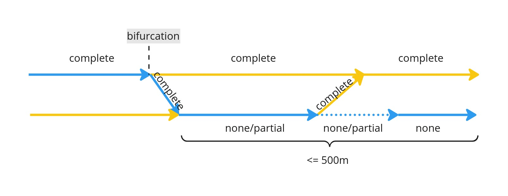
https://miro.com/app/board/uXjVK51cQcY=/?moveToWidget=3458764592838800361&cot=14[Link to Miro]

=== Suppression of Forks

On creation of `ExitHov` instructions, the incoming arc of the junction is consumed, and e.g. fork
handlers should not be able to create instructions for that arc. For that reason, the handler is
placed before the fork handlers in the handler sequence.

There is another case where the handler has to manipulate the creation of forks. In case we are
not in HOV and the off-route arc at the bifurcation is complete carpool, it is clear to the driver
that they must not go there. In that case we consume the arc without an instruction in order to
suppress a potential superfluous fork.

== HOV *Lane* Handler

=== Audi Specs

There is a document from Audi that describes the requirements for HOV *lane* handling. For ease of
use, here is a screenshot of the relevant part:

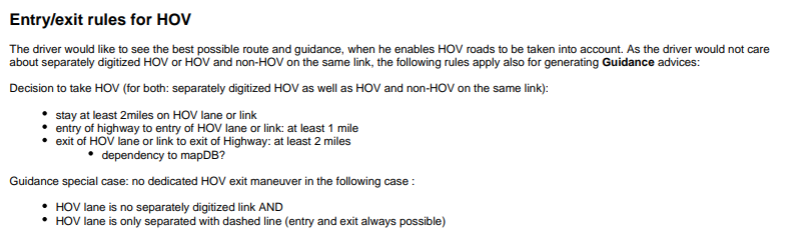

The complete specification document can be found here:
https://tomtominternational.sharepoint.com/:b:/r/sites/nav-dx-guidance/Shared%20Documents/Audi%20specifications/NAVHCP3-NAV_GUIDANCE_DYNAMIC-160621-1220-333.pdf?csf=1&web=1&e=3O0Ve9[Audi Specs].

NOTE: In our implementation *1 mile* is defined as exactly *1600 meters*, which was considered
precise enough for our purposes.

=== Challenge

For multi-digitized HOV roads, the routing engine decides which road to take, so the guidance engine
does not need to check for any conditions (in theory the routing engine could check these
conditions, but it is not clear if this is worked on or planned at all). But for single-digitized
HOV roads, the Audi specs impose clear requirements for when to issue an `EnterHov` or `ExitHov`
instruction.

The main challenge is that there might be miles and miles of distance between the HOV entrance and
exit. Because of performance limitations, it is not possible to always create pairs of such
instructions in one go, which indeed would guarantee perfect adherence to the Audi specs. We had to
make a compromise here and decouple the generation for these two.

So how can we be sure, that if we create an `EnterHov` instruction at some position, we can be sure
that we will be able to create an `ExitHov` instruction for a highway exit, and that both fulfill
the requirements?

For a valid `EnterHov` instruction, it is not too complicated:

* starting from the current arc, make sure to find an HOV entrance that is at least *1 mile* of
highway away
* make sure that from that entrance the driver can stay on HOV for at least *2 miles*.

But how do we guarantee that we can create a valid `ExitHov` instruction for the entrance? It could
be possible that the route takes a highway exit that has no timely HOV exit after the *2 miles*
required driving on HOV.

The solution is to scan the route for some more miles ahead. If we encounter an highway exit without
an adequate HOV exit, we do not generate the `EnterHov` instruction in the first place. All this
is described in detail in chapter <<_enterhovsituationdetector>>.

=== Architecture

`HovLaneHandler` is a long ranged situation handler, which means

* it is called before the ranged situation handlers
* it looks far beyond the current arc and may create an instruction somewhere inside that scanned
road stretch
* it does not consume any arcs
* if an instruction has been created, the ranged handlers are called for all arcs starting from the
current arc leading to the maneuver point of the instruction
* if no instruction has been created, it is expected that the ranged handlers are called on the
arc following the current one, *which can be violated if the ranged handlers consume more than one
arc*

The handler is responsible for generating both, `EnterHov` and `ExitHov` instructions. If, according
to the accumulated HOV state, we are already in HOV, it looks for an exit, otherwise it looks for an
entrance. That means it will not create both instructions in the same call to `generate`.

Note, that the handler uses both HOV arc information (`IS_COMPLETE_CARPOOL_ROAD`) and HOV lane
information (`kHOV`), so it suffers from potential inconsistencies between the two, as described
above.

The core functionality for detecting HOV lane entrances is implemented in
`EnterHovSituationDetector` and for HOV lane exits in `ExitHovSituationDetector`. There is a slight
coupling between these two, as the `EnterHovSituationDetector` will also check for some distance
if there is an highway exit for which no HOV exit can be generated. In that case, the `EnterHov` is
suppressed. This though does not guarantee that there will always be a valid `ExitHov` instruction
for some highway exit, here we rely on smart designing of the road network.

As mentioned previously, the *lane* handler does not create instructions at junctions, but uses
segment boundaries as the decision and ultimately as maneuver points.

== `EnterHovSituationDetector`

=== Rules for generation of `EnterHov`

The following rules are based on the <<_audi_specs>>:

* The driver must be driving in the motorway for at least *1 mile* before we can issue the EnterHov;
* The HOV entry requires a lane divider that allows crossing from non-HOV to HOV;
* The HOV entry may take place in the middle of a LaneDataSegment (if that is required to comply
with the above mentioned minimum distance in the motorway);
* It is only worth generating `EnterHov` if the driver can stay in the HOV lane for at least
*2 miles* (starting from the HOV entry).

NOTE: These requirements do not hold for `EnterHov` created by `CompleteHovRoadEntranceHandler`,
because for complete carpool roads the routing engine determines if we enter HOV.

Based on that there are a few important thresholds defined:

* `kMinHovEntryDistance`: *1 mile*; the minimum distance the driver must stay on the motorway
before being allowed to enter HOV.
* `kHovEntrySearchHorizon`: *4 miles*; search horizon for the HOV entrance.
* `kMinHovDrivingDistance`: *2 miles*; the minimum distance the driver must stay on HOV after
the HOV entrance.
* `kMinHovExitDistance`: *2 miles*; the minimum distance of an HOV exit segment to the road exit.
* `kMinLaneDataWindowSize`: *5 miles*; the minimum distance of lane data to be loaded after the
HOV entrance.

=== Starting Conditions

Analogous to the `CompleteHovRoadEntranceHandler`, detection of HOV entrance is only executed if
the driver is *not* already in HOV, according to the accumulated HOV data state.

There are three different starting situations that are handled slightly differently:

* `IsEnteringMotorwayThenTakingHov`: The driver enters the motorway from a non-motorway road or a
ramp
* `IsRouteStartingOnMotorwayThenTakingHov`: The route starts on the motorway
* `IsOnMotorwayThenTakingHov`: The driver is already on the motorway

Different preconditions are checked and then a common function `CheckConditionsAndGenerateHov` is
called with the following parameters:

* `start arc`: The arc the entry search is started from
* `min entry hov offset`: minimum route offset for HOV entrance, based on the *1 mile*
`kMinHovEntryDistance`
* the way to search for the entry:
** `kSeekEntryAtDistance`: Search for the first that fulfills the conditions
** `kSeekFirstEntry`: Search for the first entry and abort if that entry does not fulfill the
conditions

The following diagrams show how these starting parameters are set for the different situations:

==== `IsEnteringMotorwayThenTakingHov`:

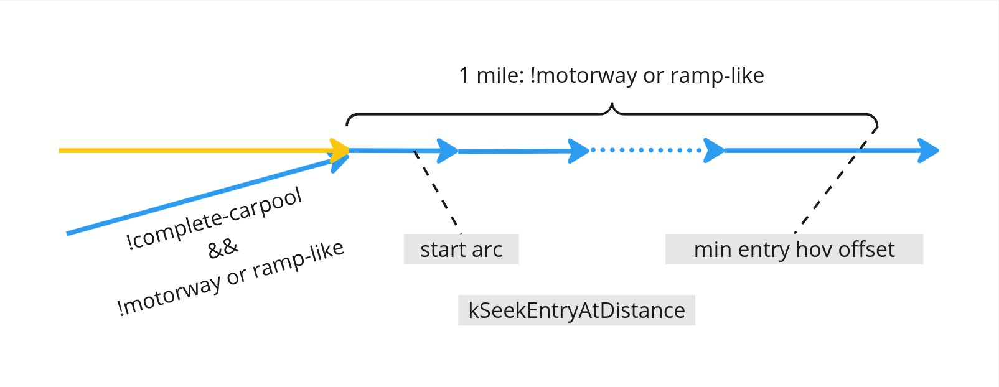
https://miro.com/app/board/uXjVK51cQcY=/?moveToWidget=3458764593017042075&cot=14[Link to Miro]

==== `IsRouteStartingOnMotorwayThenTakingHov`:

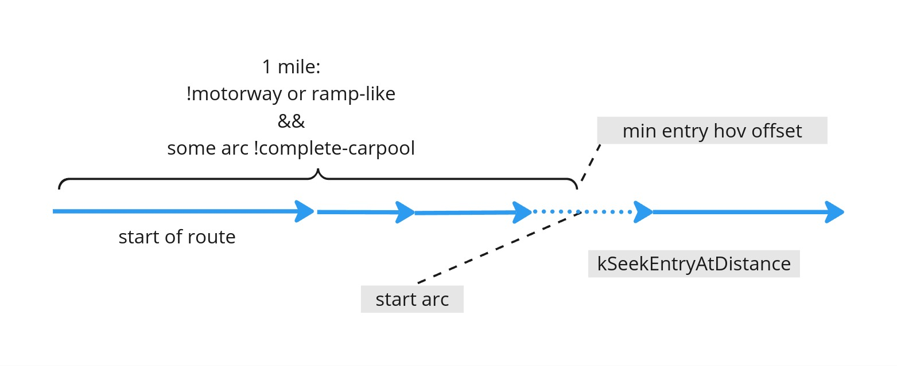
https://miro.com/app/board/uXjVK51cQcY=/?moveToWidget=3458764593017042798&cot=14[Link to Miro]

==== `IsOnMotorwayThenTakingHov`

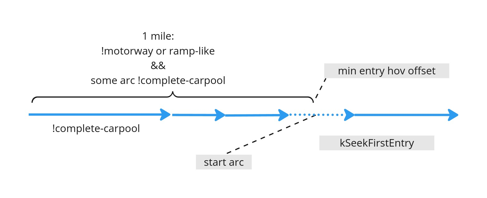
https://miro.com/app/board/uXjVK51cQcY=/?moveToWidget=3458764593017117090&cot=14[Link to Miro]

NOTE: Personal comment from Michael Schnürmacher: I think this differentiation is overly
complicated and is even buggy (e.g. NAV-116398). In my point of view one should always use
`kSeekEntryAtDistance`, making this differentiation unnecessary. I also think the different start
arcs are not necessary, one should just start from the first arc on the motorway. The checking for
complete carpool roads is also not consistent between the situations and potentially other checks
as well.

=== Most Common Example

The following image shows the most common situation, where the driver may enter HOV and can also
exit in time to the take the road exit.

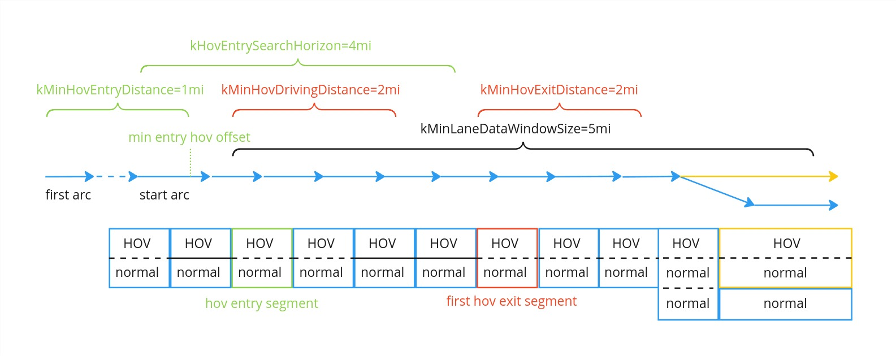
https://miro.com/app/board/uXjVK51cQcY=/?moveToWidget=3458764593724840272&cot=14[Link to Miro]

The `first arc` is the arc the handler starts with. As described in the previous section, we
might scroll forward to the `start arc`, which is where the driver already spent *1 mile* on the
highway. From there onwards we search for the HOV entry segment. After another *2 miles* on HOV,
we find the first HOV exit segment and have to make sure that this is at least *2 miles* before the
road exit.

All steps for generating the `EnterHov` instruction are described in depth in the following
sections.

=== Find HOV Entry

Given the parameters explained in the previous section, the next step is to find an HOV entry
segment. We are searching for `kHovEntrySearchHorizon` (*4 miles*) to find an entry that is at
least `kMinHovEntryDistance` (*1 mile*) along the highway (`min entry hov offset` as defined in
the previous section). The search interval is defined as:

[.text-center]
[Start(`start arc`), Start(`start arc`) + `kHovEntrySearchHorizon`].

Before lane data is fetched, we check if any of the arcs in that interval are carpool roads, because
only then would we expect HOV lanes at all. This is mainly a performance optimization.

If that is the case, we fetch lane data and search for a segment that has some "reachable" HOV lane,
fulfilling the following conditions:

* the segment is *not* too short; it must be at least *5 meters* long
* all lanes in the segment are HOV (actually it should not be that way, complete carpool roads
should be handled by the HOV *road* handlers, so if we find such a segment we could in theory
abort here)
* there is some HOV lane that is reachable, see <<_lane_reachability>>

If the seek mode is `kSeekFirstEntry`, we stop at the first reachable HOV entrance, if it is
`kSeekEntryAtDistance`, we would only consider segments that are beyond `min entry hov offset`.
As discussed before, it seems that when using `kSeekFirstEntry` we sometimes miss creating a valid
`EnterHov` instruction, because we select a segment that is not beyond `min entry hov offset` and
then abort immediately instead of checking the rest of the search interval.

Before returning the found segment as the HOV entry segment, we check that all arcs up to that
point are motorway.

==== Lane Reachability

If there is more than one HOV lane, we currently have no way to figure out which is
the correct one to test for reachability and which should ultimately be taken by the driver. We
also do not know in which lane the driver is at the moment. Because of all these unknowns, we just
support the most usual situations:

* all HOV lanes are either at the middle-side (not in the middle!) or at the curb-side of the road
*and*
* normal lanes are between these middle-side and curb-side HOV lane blocks

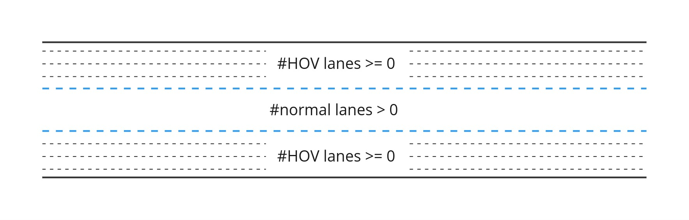
https://miro.com/app/board/uXjVK51cQcY=/?moveToWidget=3458764593142676103&cot=14[Link to Miro]

We then only check the reachability of a normal lane to its adjacent HOV lane, marked in blue in
the image above.

Changing to such HOV lane is permitted if:

* respective lane change permission is `kPermitted` *and*
* divider type allows such lane change (`kUnknow` is interpreted as being allowed)

=== Driver can stay on HOV long enough

The result of the previous step is `hov entry segment`, the segment the driver should use to enter
the HOV lane.

This step checks if there is continuous HOV lane for at least `kMinHovDrivingDistance`
(*2 miles*) starting from `hov entry segment`, which is defined by the following interval:

[.text-center]
[Start(`hov entry segment`), Start(`hov entry segment`) + `kMinHovDrivingDistance`].

=== Driver may exit HOV early enough

[.text-center]
[Start(`hov entry segment`) + `kMinHovDrivingDistance`, Start(`hov entry segment`) + `kMinLaneDataWindowSize`].

If all segments in that interval have an HOV lane, there is no exit and the `EnterHov` is
finally generated.

Otherwise, we search for `first hov exit segment`, which is the first segment in the interval, that
can be used to exit HOV lane (see <<_definition_of_hov_exit_segment>>). If its offset is earlier
than

[.text-center]
Start(`first hov exit segment`) + `kMinHovExitDistance`

`EnterHov` can finally be generated.

==== Definition of HOV Exit Segment

The driver may leave a segment if:

* the segment is at least *5 meters* long (if it is too small the maneuver would be too risky) AND
* the segment is *not* complete carpool (because there is no non-HOV lane to go to) AND
* the segment has a lane divider that allows crossing from HOV to non-HOV (we make the same simple
assumptions about the structure of HOV and non-HOV lanes in the segment as for lane reachability,
see <<_lane_reachability>>)

The segment is also a valid HOV exit segment if it does not contain any lanes or all lanes are
non-HOV lanes.

We already learned about ramp-like HOV exits in <<_completehovroadexithandler>>. These also exist
for single-digitized HOV roads, e.g. (37.67717753994822, -122.11843863627533):

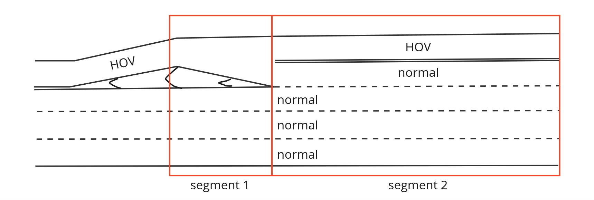
https://miro.com/app/board/uXjVK51cQcY=/?moveToWidget=3458764593350174419&cot=14[Link to Miro]

In the above image, the middle-most lane is HOV, but in this segment, because of the solid dividers,
there is no way to change to a normal lane. For segment 2, the same holds. But clearly, the driver
can use the transition from segment 1 lane 4 to segment 2 lane 4 to exit HOV.

We check if for some segment 1, there is an HOV lane (again, we do not know in which lane the driver
is), that has an outgoing connection ending up in a normal lane in the next segment 2. If that is
the case, we chose segment 2 as the HOV exit segment, because we want the instruction point to
be exactly between segment 1 and 2 and HOV instructions are usually placed at the beginning of the
manuever segment.

== Exit HOV Situation Detector

=== Rules for generation of ExitHov

The following rules are based on the <<_audi_specs>>:

* The HOV exit requires a lane divider that allows crossing from HOV to non-HOV;
* The HOV exit requires a minimum distance of *2 miles* to the road exit;
* The HOV exit takes place in the beginning of its LaneDataSegment (so the driver is guaranteed to
have time for leaving the HOV lane).

Former requirement:

* We suppress the generation of ExitHov if, between the HOV exit and the road exit, the driver is
never forbidden to leave the HOV lane.

Explanation: It was requested from Guidance to remove that requirement, because before the
introduction of accumulated HOV state, we generated `EnterHov` only if the last HOV instruction was
no `EnterHov` (or after initialization). If the driver exited HOV without an instruction, we would
not be aware and miss the next HOV entrance. Using the accumulated HOV state, it is still not clear
if we could resurrect that requirement. Currently, accumulated data detects that the driver left
HOV without an instruction, if they are on a non-HOV road for at least *1 km*. It is unclear if
that check is sufficient for e.g. exit ramps that lead to another highway, that might have HOV lanes
as well.

Note: These requirements do not hold for `ExitHov` created by `CompleteHovRoadExitHandler`, because
for complete carpool roads the routing engine determines if we leave HOV.

=== Detection of HOV exit

Analogous to the `CompleteHovRoadExitHandler`, detection of HOV exit is only executed if the driver
is already in HOV, according to the accumulated HOV data state.

NOTE: Because accumulated data is only updated in the end of a call to `generate`, HOV entrances
and exits are never detected in the same call of the lane handler and thus `EnterHov` and `ExitHov`
instructions can never be created for the same arc. This means that cases where the HOV entrance
and the only valid HOV exit are in the same arc are not handled correctly. Such situation has never
been observed in practice and the limitation is accepted.

==== Find Highway Exit

The first step of generating `ExitHov` is to search for a junction where the driver is not able to
continue on HOV, which is usually a highway exit. We start from `current arc` for
`kMaxRoadExitSearchDistance` (*4 miles*), which is from `window start` until `window end` in the
image below.

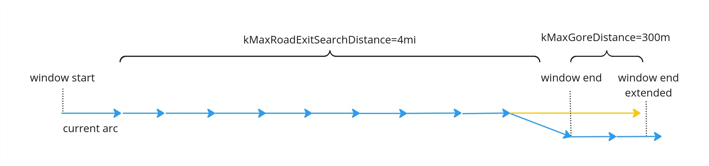
https://miro.com/app/board/uXjVK51cQcY=/?moveToWidget=3458764593599574743&cot=14[Link to Miro]

We use lane data to determine if the driver will not be able to continue on HOV after that junction.
For HCP3 maps, segments overlap arcs and even some segments after the junction may still contain
lane data for both, off-route and on-route arc. So if e.g. HOV lanes continue on the off-route arc,
but not on the on-route arc, we cannot verify that up until some distance after the junction, which
is defined by `kMaxGoreDistance` (*300 m*). We thus have to load lane data for:

[.text-center]
[`window start`, `window end extended`].

NOTE: Michael Schnürmacher: I wonder why we do not rely on `IS_COMPLETE_CARPOOL_ROAD` for the
on-route arc after the junction to determine if the driver is able to continue on HOV. If that flag
is absent, HOV is supposed to end.

==== Find Valid HOV Exit

If the driver is *not* forced to leave HOV, no `ExitHov` is required and we abort. Otherwise we
have to search for an HOV exit at least `kMinHovExitDistance` (*2 miles*) before such
`exit junction`:

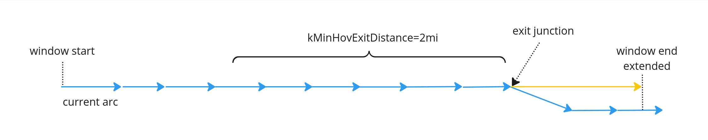
https://miro.com/app/board/uXjVK51cQcY=/?moveToWidget=3458764593711985263&cot=14[Link to Miro]

The logic to determine if a segment is a valid HOV exit segment is the same as for
<<_definition_of_hov_exit_segment>>. We make some special distinctions though where to place the
maneuver point (to some extend these are aesthetic choices):

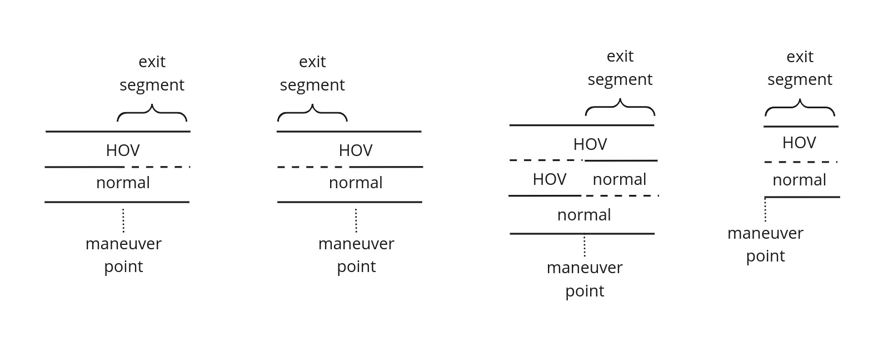
https://miro.com/app/board/uXjVK51cQcY=/?moveToWidget=3458764593719236646&cot=14[Link to Miro]

NOTE: Michael Schnürmacher: If the found exit HOV segment is the first segment of the stretch, we
abort. I think this is wrong and we potentially miss HOV exits.
