// Copyright (C) 2022 TomTom NV. All rights reserved.
//
// This software is the proprietary copyright of TomTom NV and its subsidiaries and may be
// used for internal evaluation purposes or commercial use strictly subject to separate
// license agreement between you and TomTom NV. If you are the licensee, you are only permitted
// to use this software in accordance with the terms of your license agreement. If you are
// not the licensee, you are not authorized to use this software in any manner and should
// immediately return or destroy it.

= Natural Continuation at bifurcations

In order to determine whether a fork or switch highway instruction should be issued we use the following logic. +
If the map contains a lane data, we rely upon lane analysis around bifurcation. +
The result of such analysis is described in the <<Glossary>> section below. +
If the lane data is not available, we use data from the routing building block.

== Glossary

*Bifurcation* - is a road situation, where one road divides into two drivable roads. +
Each bifurcation consists of the road that remains on route and an alternative, as shown on the picture below. +
*On-route lane* - is a lane the driver should use to stay on the route. Highlighted in [blue]#blue# on the picture below. +
*Off-route lane* - is a lane the driver must not use to stay on the route.
Otherwise, he/she will deviate from the route, and eventually end up in the wrong location. Highlighted in [red]#red# on the picture below. +
*Segment with on-route lanes only* - is a road stretch that happens 1500 meters before the bifurcation and contains only lane(s) on route. If a bifurcation occurs shortly after another guidance instruction, only the lanes following this instruction will be taken into account. Highlighted in [green]#green# on the picture below.

=== A bifurcation analysis depicted.

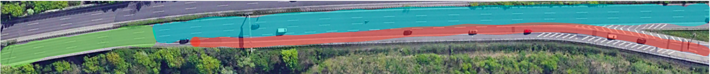

== Examples

At the moment we're distinguishing 6 separate NC cases.
Cases 1-4 are detected based on lane data. +
Cases 5-6 are detected based on data from the routing building block only, +
when:

1. Either the lane data is not available
2. Or lane data contains a single on-route lane and 0 off-route lanes at the furcation point.

== Situation detection using lane data

=== Case #1 - lanes on route prevail

Location coordinates: 51.23347, 6.71101 +

The first case we're going to consider is highway-specific. +
If the off-route lane(s) appears close to the bifurcation, we assume it won't confuse the driver when the number of on-route lanes is higher than off-route ones. +
Since the driver should not do anything but stay in the current lane in such situations we consider them NC. +
Usually, the signpost, which resides before highway bifurcations helps to keep the driver in the current (on-route) lane.

We consider the following situation as the NC,
since the number of on-route lanes is 3, whereas the number of off-route lanes is 1.
Moreover, the rightmost (off-route) lane appears close before the bifurcation,
so the driver will unlikely occupy it while approaching the fork.

With that being said, to detect the first case only 2 conditions must be met:

1. the number of lanes on the route must be greater than the number of lanes going off route +
*Remark:* If lanes going off-route have been divided into some additional lanes, then these off-route split lanes should not be taken into account +
2. a segment with on-route lanes only is present. +

==== Driver's view

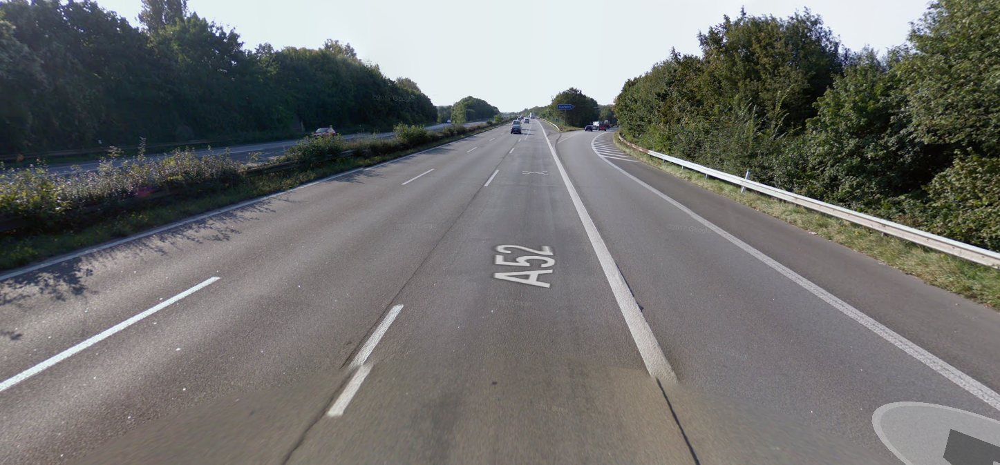

==== The route that takes NC

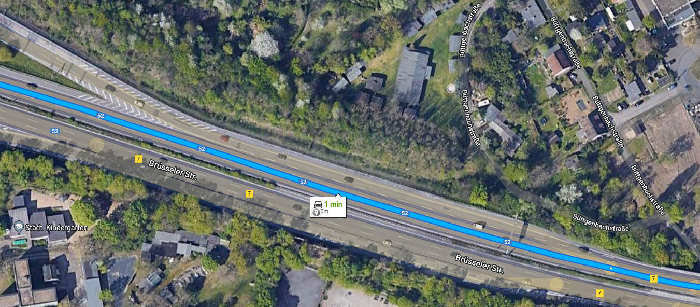

=== Case #1.1 - *Negative case* Fork on HOV lanes

Location coordinates: 37.4112850,-122.0769453

In this negative case, the driver is currently on any of the HOV lanes available and the route contains a furcation in the HOV lanes.
This shall *not* be considered as a natural continuation, as the HOV lanes are split into two directions. The rest of the lane count
should not be taken into consideration for this case and it must immediately return as not a natural continuation.

==== Driver's view

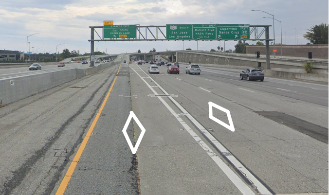

==== The route that takes NC

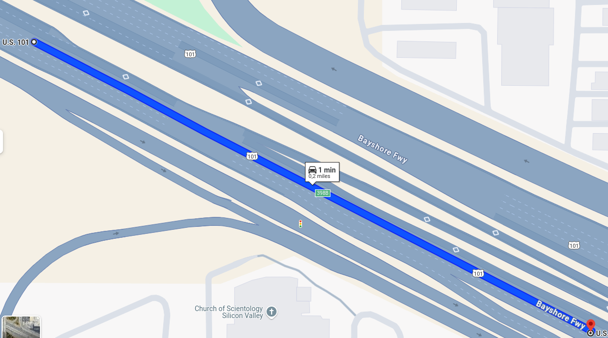

=== Case #2 - the vast majority of lanes are on route

Location coordinates: 32.65023, -117.06619

The next case is USA-specific mostly, since it happens on wider roads, where there are 4 or more lanes. +
When the driver is approaching the bifurcation he/she might even not notice the fork itself due to the road width. +
As can be seen in the photo below on the widest roads, it's natural to occupy lanes near the center, +
instead of lanes closer the curb, which usually lead to an exit. +
We consider such situations as NC, even if there is no segment with on-route lanes only before the fork. +
There is only one exception to this rule. The route should not come from the merging road, because there is a risk, +
that the driver will stay on the lane that is closest to the curb, which usually leads to the road exit. +
To detect that this not the situation described above, the following 2 conditions must be met: +
1. the number of lanes on the route must be at least 3 times bigger than the number of lanes going off route +
2. the route should not come from the merging road

==== Driver's view

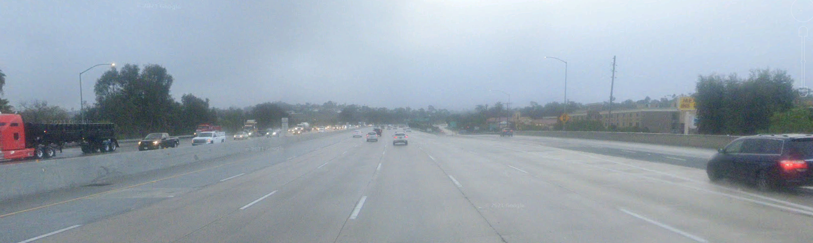

==== The route that takes NC

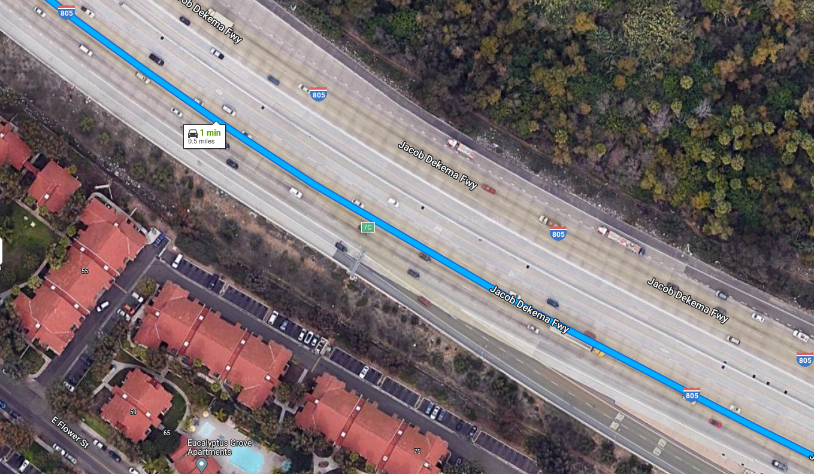

=== Case #3.1 - alternative is motorway entry or exit

The fork alternatives should not get drivers out of the way in a case when they're: +
1. appearing close to the bifurcation from the lane the driver is going on +
2. leading to the motorways entrance/exit. +
Usually, such bifurcations have a signpost that indicates that a straight direction is on the route.
It means, even we have only 2 lanes at the bifurcation, off-route one can be easily recognized and thus, no instructions are required from our side. +

Essential criteria to match described case: +
1. segment with on-route lanes only must be present before the bifurcation +
2. there must be only 2 lanes at the bifurcation +
3. alternative must be a motorway entrance or exit

The pictures below expose the logic behind this case. The driver will unlikely take the right lane not only because it appears only several tens of meters before the fork and leads to an exit, +
but also because our route direction is complemented by lane arrows and the signpost, which makes it almost impossible to deviate from the route.

==== Driver's view

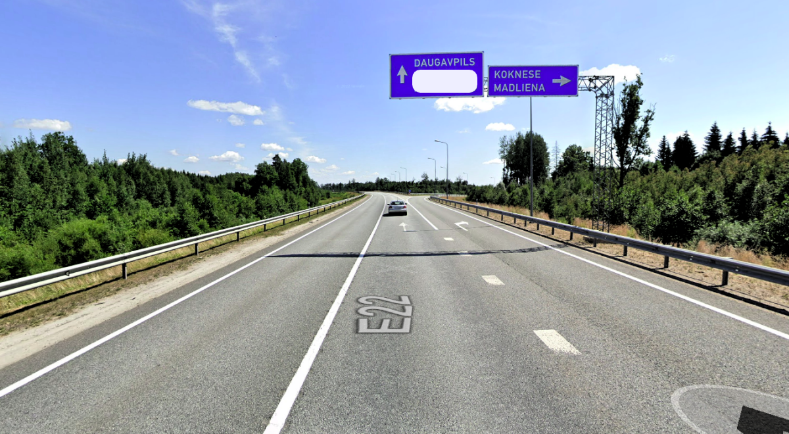

==== The route that takes NC

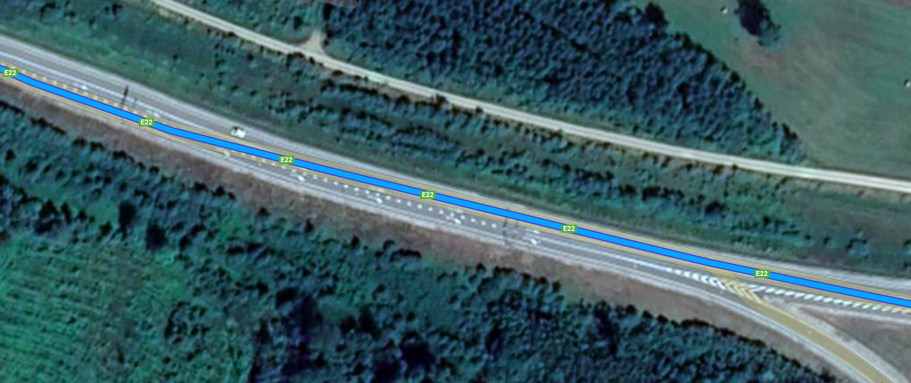

=== Case #3.2 - alternative is motorway exit with exit signpost

Location coordinates: 49.86600, 10.95671

This is a variation of case 3.1.
Essential criteria to match the case are:

1. segment with on-route lanes only must be present before the bifurcation
2. the number of lanes on route must be >= than the number of lanes off route at the bifurcation
3. alternative must be a motorway entrance or exit (e.g. a ramp)
4. the signpost path between the incoming line and the alternative must be present and has type `Exit`.

==== Driver's view

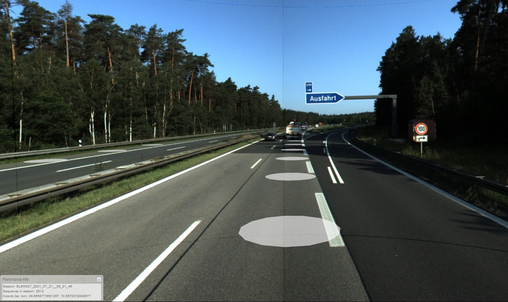

==== Satellite view

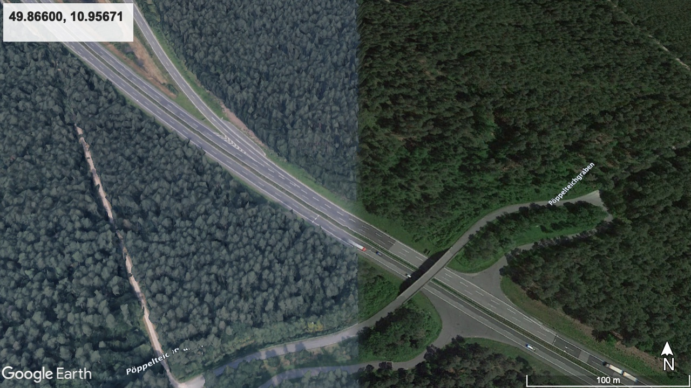

=== Case #4 - the alternative is less developed

Location coordinates: 57.0692647, 24.3196589

The fourth case is based on the assumption that when the bifurcation alternative is visually less developed +
than the road that stays on the route, it will unlikely confuse the driver. +
If the alternative road is service access we consider it less developed.
Also, the alternative is less developed if a difference between functional road classes is at least 4 for city roads, +
whereas for motorways, the on-route class should be at most 1, and for the alternative at least 4. +
As in Case #2 (the vast majority of lanes are on route), the exception to this rule is only in case the route is coming from the merging road. +
To detect the situation, following conditions must be met: +
1. bifurcation alternative is less developed than the road that remains on the route +
2. the route should not come from a merging road

In the example below, the alternative leads to a gas station and if we would have a route that goes through this station we would definitely issue an instruction to make the driver leave the route. In our case, the route doesn't go through the station. Thus, no instructions are required.

==== Driver's view

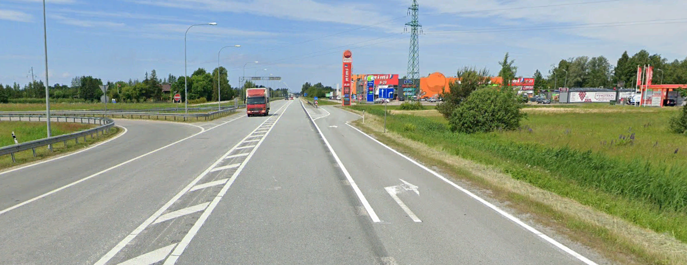

==== The route that takes NC

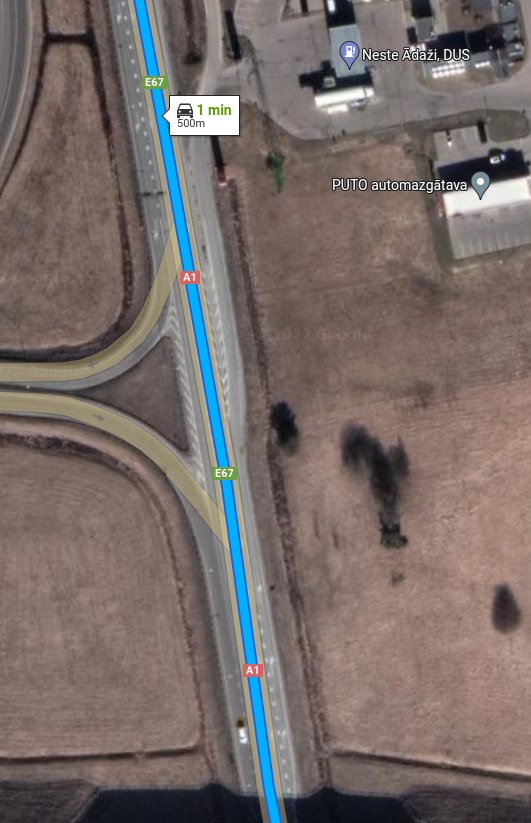

== Situation detection using the routing building block only

=== Case #5 - admin road class higher than alternative

Location coordinates: 37.3861581, -122.0476019

The logic behind this case is much simpler than the previous ones since it relies upon only 1 parameter. +
An instruction is suppressed when the on-route road has a higher administrative class than the alternative. +
Usually, alternative roads look less developed and should not tempt the driver to take them.

==== Driver's view

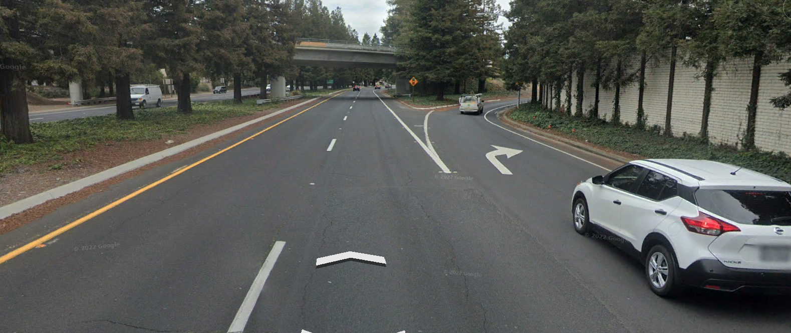

==== The route that takes NC

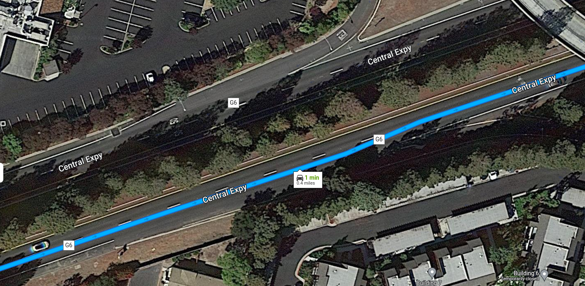

=== Case #6 - the alternative has a special link type

Location coordinates: 37.7323455, -122.4141043

Sometimes even when 2 outgoing roads at bifurcation have the same administrative road class, +
we consider the road that remains on route a natural continuation. +
This happens when the alternative road is marked as "special" on the map, whereas the road that remains on the route is not. +
Special roads are the roads that lead to the gas station, rest area, parking, service station, or highway exit. +
It can be even a pedestrian road that is closed for traffic.
When the alternative meets such criteria, we consider it confident to skip an instruction at the bifurcation.
In this example, the driver can clearly see that the alternative road is a ramp that leads to another highway. +
If he/she wants to continue driving straight it's natural not to stick to the curbside.

==== Driver's view

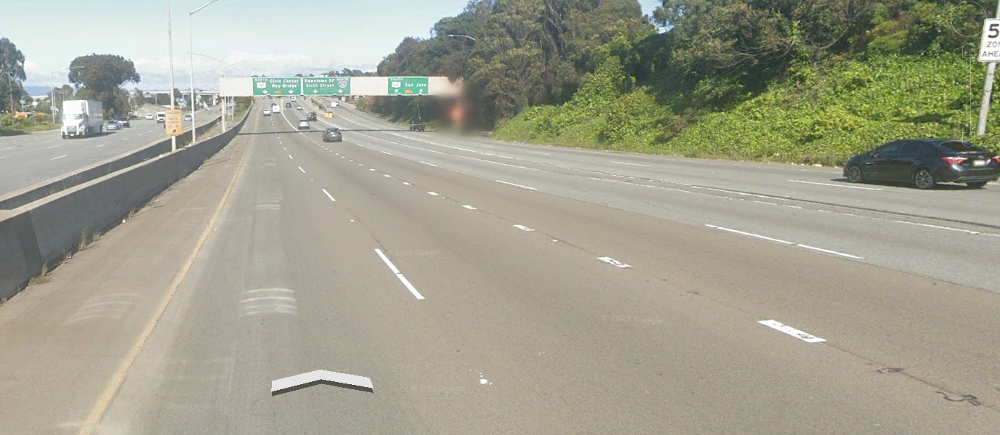

==== The route that takes NC

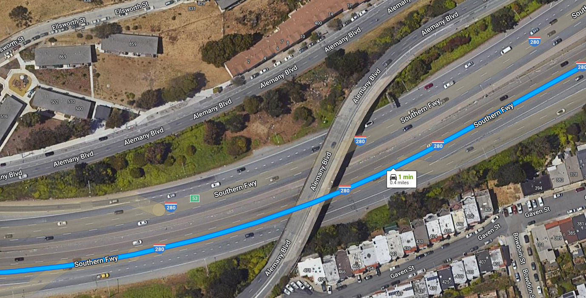
