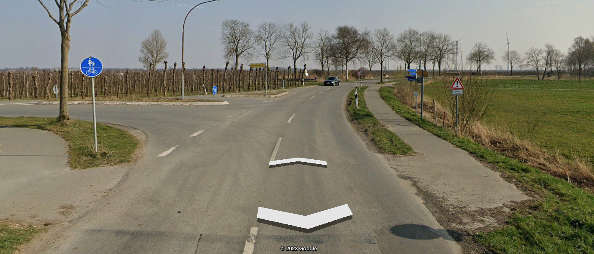
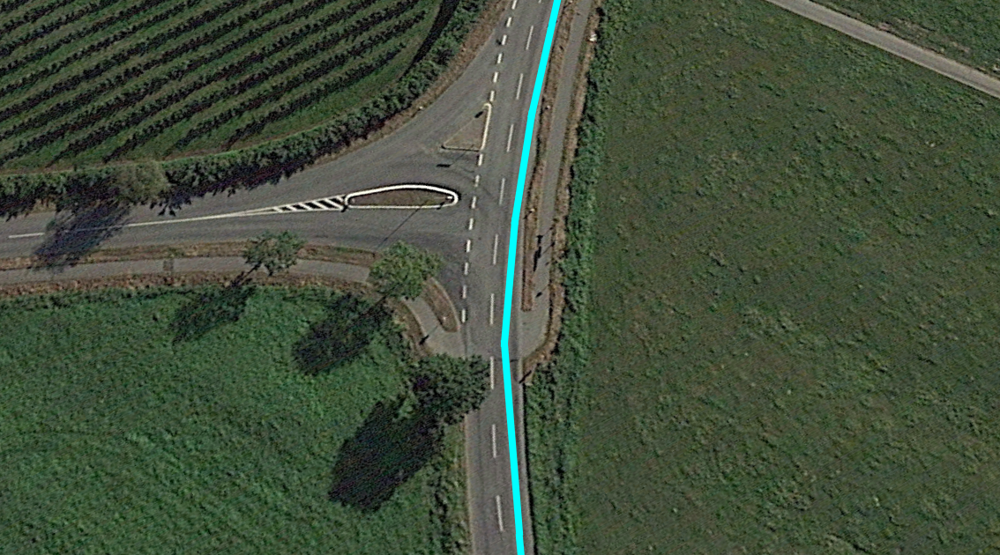
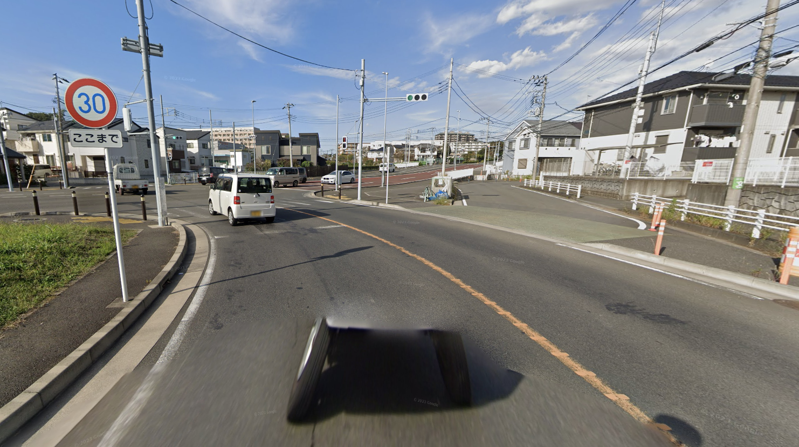
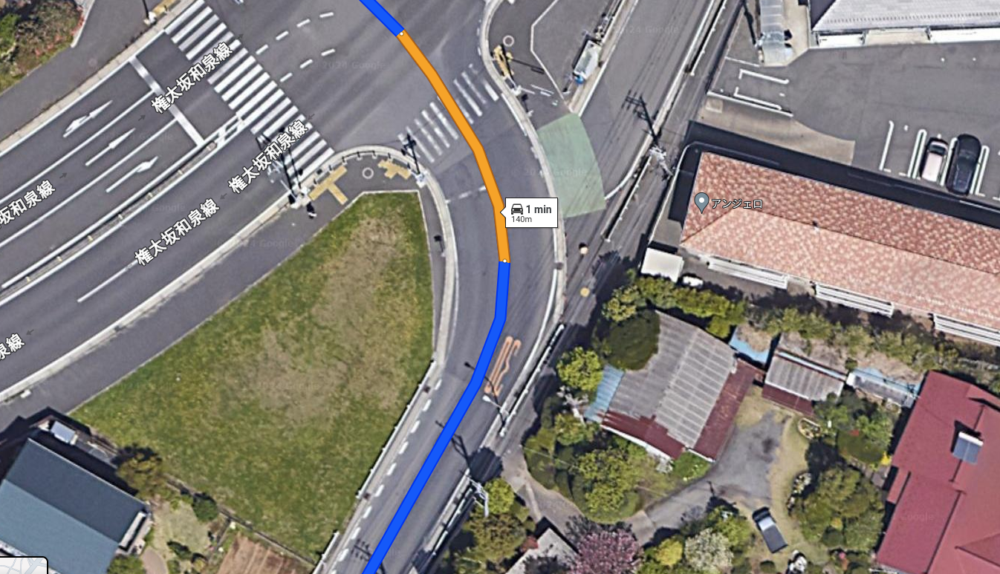
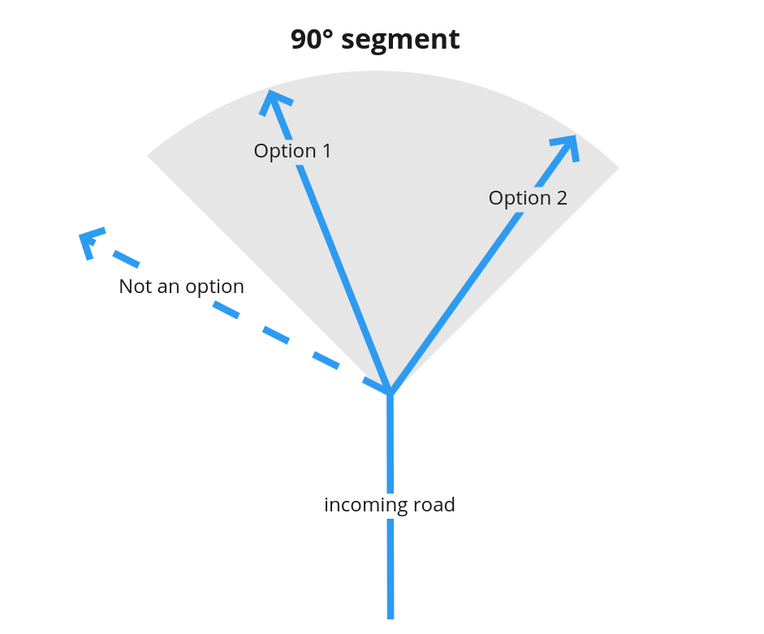
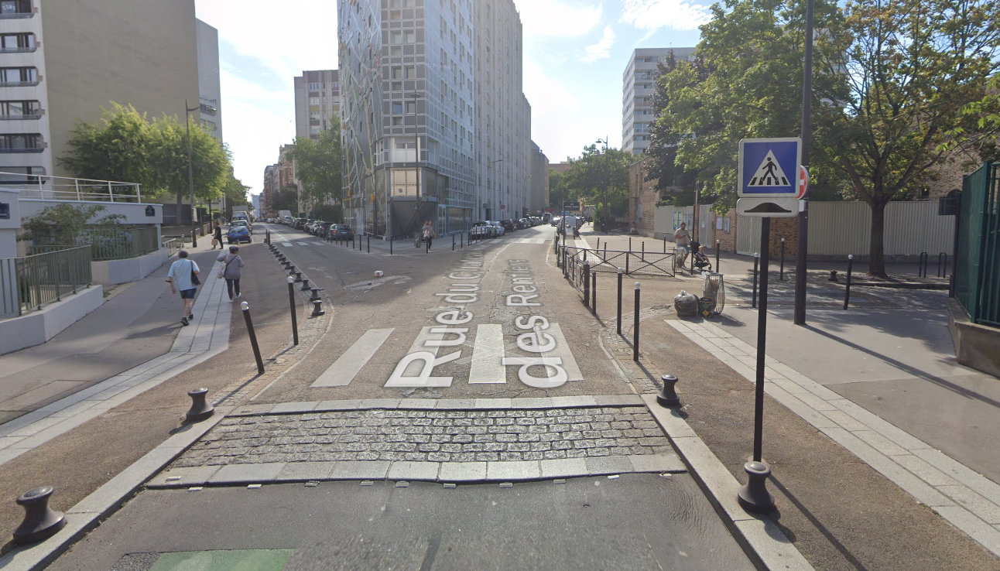
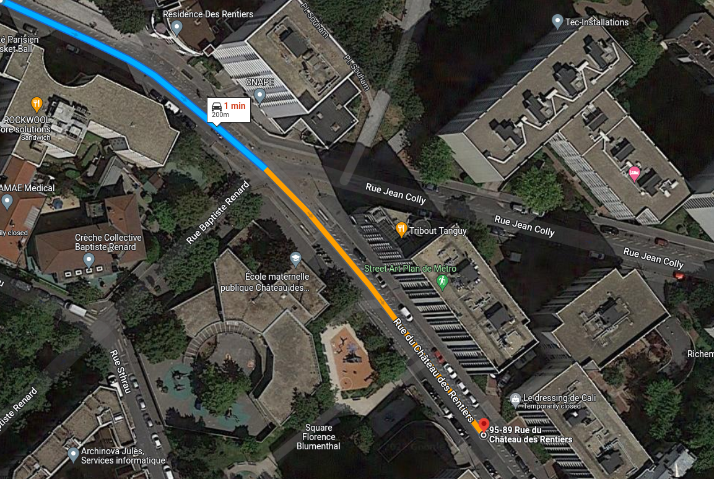
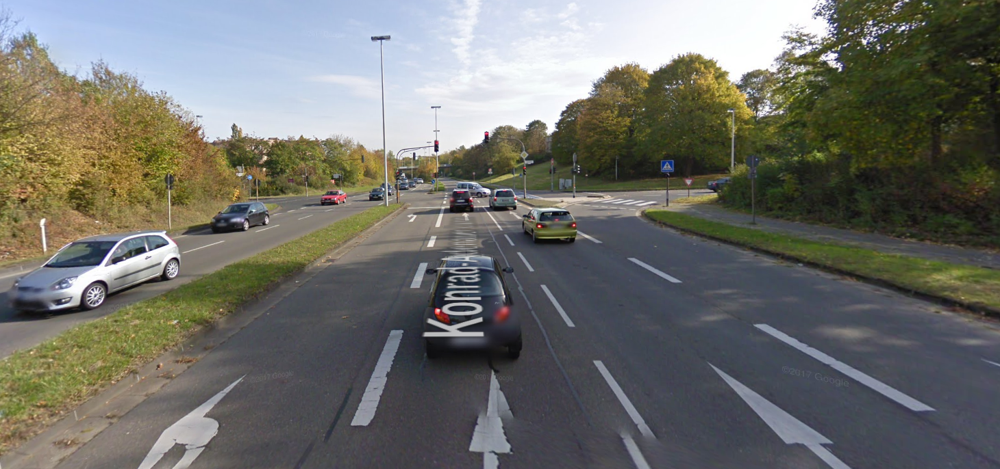
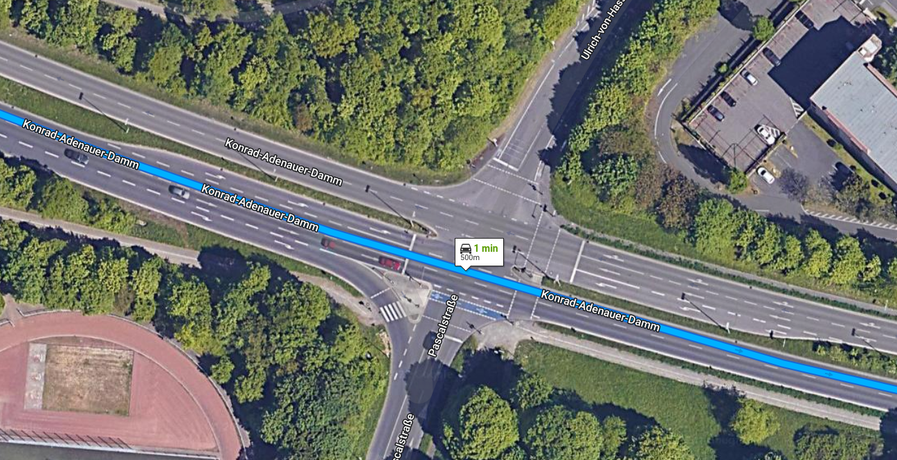

// Copyright (C) 2022 TomTom NV. All rights reserved.
//
// This software is the proprietary copyright of TomTom NV and its subsidiaries and may be
// used for internal evaluation purposes or commercial use strictly subject to separate
// license agreement between you and TomTom NV. If you are the licensee, you are only permitted
// to use this software in accordance with the terms of your license agreement. If you are
// not the licensee, you are not authorized to use this software in any manner and should
// immediately return or destroy it.

= Natural Continuation at intersections

When a driver is facing a intersection that presents several options to drive into, normally that one of the options is the continuation of the current road he is already driving. +
This way, we expect that these two roads share most of their characteristics and call this pair of roads as a Natural Continuation.

== NC detection algorithm for the three ways junctions

The process involves deciding if the route follows the natural continuation at a simple three-way junction.
Two situations are identified:

1. Natural continuation at simple T-junctions
2. Natural continuation when passing by a minor road

=== 1. NC at simple T-junctions

A simple T-junction is an intersection where one road terminates as it joins another road at approximately a 90-degree
angle, creating the shape of the letter T. When a driver follows the "head of the T," it is considered a natural
continuation if all of the following conditions are met:

1. Transitioning from the incoming road to the outgoing road does not require significant steering.
2. The alternative road connects at approximately the same angle to both the incoming and outgoing roads
(acting as the bisector).
3. Transitioning from the incoming road to the outgoing road does not require leaving the main or more significant road.

=== Example of NC at a simple T-junction

Location: 53.7042189, 9.3466669

==== Driver's view

==== The route that takes NC

=== 2. NC when passing by minor road

These scenarios occur at simple three-way intersections when the road passes by a minor road, which is identified by a "Yield" or "Stop" sign or is marked with a start or destination road flag. When a driver follows the main road it is considered a natural continuation if all of the following conditions are met:

1. Transitioning from the incoming to the outgoing road does not require significant steering actions.
2. The off-route road has either a "Yield" or "Stop" sign, or is marked with a "start or destination" road flag.
3. Transitioning from the incoming road to the outgoing road does not require leaving the main or more significant road.

=== Example of NC at a simple T-junction

Location: 35.426077, 139.494040

==== Driver's view

==== The route that takes NC

== NC detection algorithm for the simple intersections

To determine whether the route takes the NC at the simple intersection we use the following steps: +
First, we are collecting outgoing roads for further analysis, except for the roads we're link:../situation_handlers/cross_simple_intersection_handler.adoc[crossing] (if any). +
The roads that bend more than 90° from a straight direction [-90°; +90°] are not collected, because they are beyond the driver's view. +
But only the road that fall into a -45° + 45° segment compared to the incoming path can be considered as a NC. +
That means if the outgoing road that diverges 70° from a straight direction receives the highest score, then NC is not detected. +
This step is represented in the image below.

Then, check and compare numerous attributes of the options for NC. We need to identify if those attributes match the attributes of the incoming road.
A score is assigned to every road that is an option, and this score is increased by 1 point for every match of any of these attributes:

1. Road number (there may be several)
2. Street name
3. Administrative or functional road classes
4. Road type

If the change of angle from the incoming road to the option falls within:

1. straight direction then we increase the score by 3 points
2. slight left/right direction then we increase the score by 2 points
3. left/right direction then we increase the score by 1 point

The roads are then ranked, and the one with the highest score is selected. +
If there is a tie, the situation is deemed unclear, and the intersection is considered to have no natural continuation.

*If a single road is found with the highest score among all alternatives, additional checks are performed:*

1. If the road is not completely straight (does not fall under _Turn::Direction::kStraight_) and there are accessible alternatives with higher administrative or road class, it is not a natural continuation.
2. If there is an accessible, straighter alternative with important administrative or road class, it is not a natural continuation. The presence of a major class and straighter alternative may mislead the driver and requires explicit guidance.
3. If there is an accessible straighter alternative (or alternatives) with the same (or greater importance) administrative or road class, it is not a natural continuation. Whenever the alternative is significantly straighter, the on-route continuation should be a road of strictly greater importance.
4. If the highest-scored line is identified, but the relative angle does not fall within a range of -45° to +45°, the algorithm will recalculate the relative angle twice, at a distance of 10 meters (45 degrees angle threshold) and 20 meters (60 degrees angle threshold) from the intersection point to verify the angle conditions (per NDS specification, angle is calculated at a distance of 15 meters).+
It helps, if the line exhibits significant curvature near the junction, so the standard angle verification method might not yield accurate results.

*If a single road with the highest score is not found, additional checks are performed:*

1. Assess if the upcoming situation is suitable for the start or end of a dual carriageway (divided highway).
2. Determine if the road before and after the intersection has the same name.
3. Check if only one turn is allowed at the intersection.

or 4. All off-route lines are of type pedestrian or blocked

If condition 1,2,3 are met or if condition 4 is met, the situation will be treated as having a natural continuation.

== Example of NC at a simple intersection

Location: 48.82833, 2.36729

Let's consider the simple intersection below.
The first option, which goes on the left and doesn't belong to the route has the same road type as the incoming road.
It receives a score of 1. +
The second option which goes straight and belongs to the route has the same road type, admin, and functional road classes as an incoming road.
It receives a score of 3. +
Since the second option received the highest score and it's on the route, we consider this situation as a Natural Continuation.

=== Driver's view

=== The route that takes NC

== Example of NC with pedestrian road

Location: 52.46860, 13.49409

image::alternative_is_pedestrian_road.png[NC street view]

== NC detection algorithm for the complex intersections

The detection of NC at complex intersections works pretty much the same way as for simpler ones with minor differences. +
We use it for detecting the situation when the driver is crossing the intersection.
It requires additional work to analyze the complex intersection itself and collect reachable exits from it.
Those exits that fall within the range of 90° in front of the driver are considered NC options. +

Then, we use the same algorithm to give scores to each option and select the one with the highest score.
If the complex intersection exit(option) that received the highest score lies on the route, we consider the situation as the NC. +
Otherwise, if no options are found or the option with the highest score is not on the route, we consider this intersection to have *no* natural continuation.

== Example of NC at a complex intersection

Location: 50.70414, 7.05193

At the complex intersection below the driver has 3 reachable exits, but only one that is in front of him/her is considered an NC option. +
Since the road that is in front of the driver is the only option, it receives the highest score. Moreover, it's on the route. +
Since the described situation is NC, we assume the driver should not receive any instructions while crossing the intersection.

=== Driver's view

=== The route that takes NC

