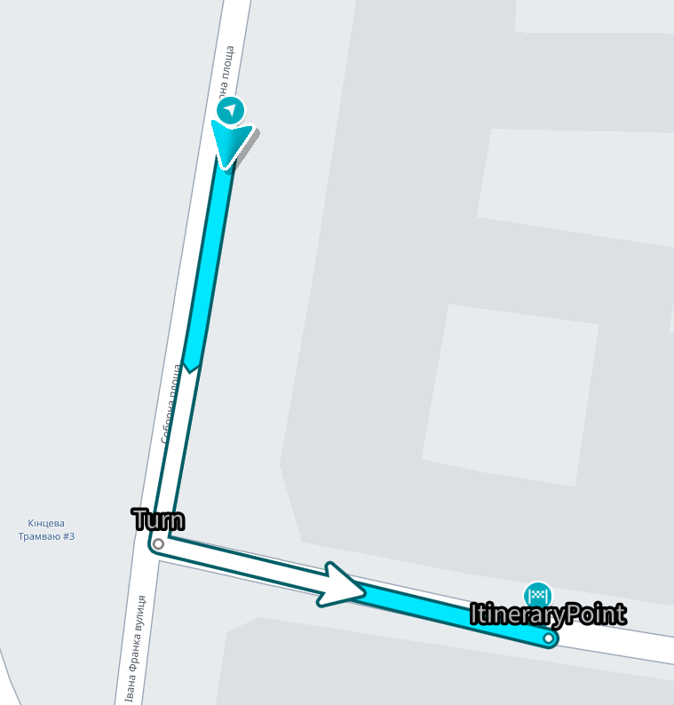
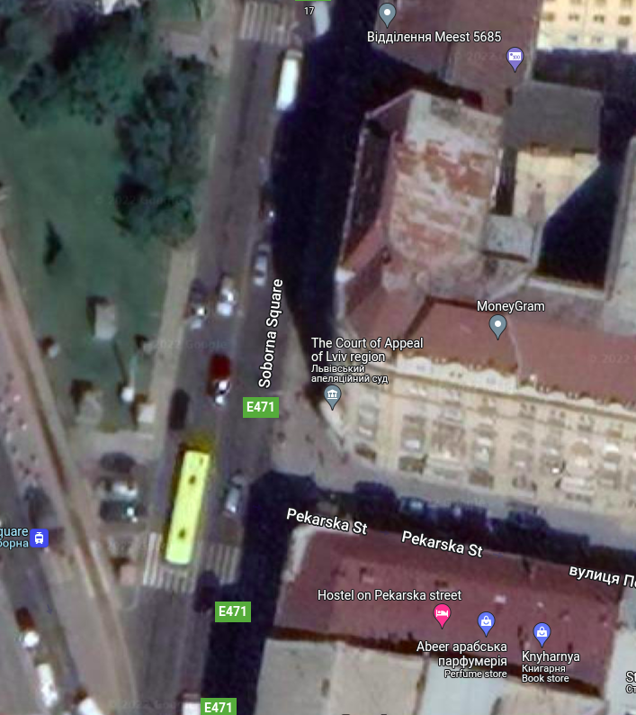
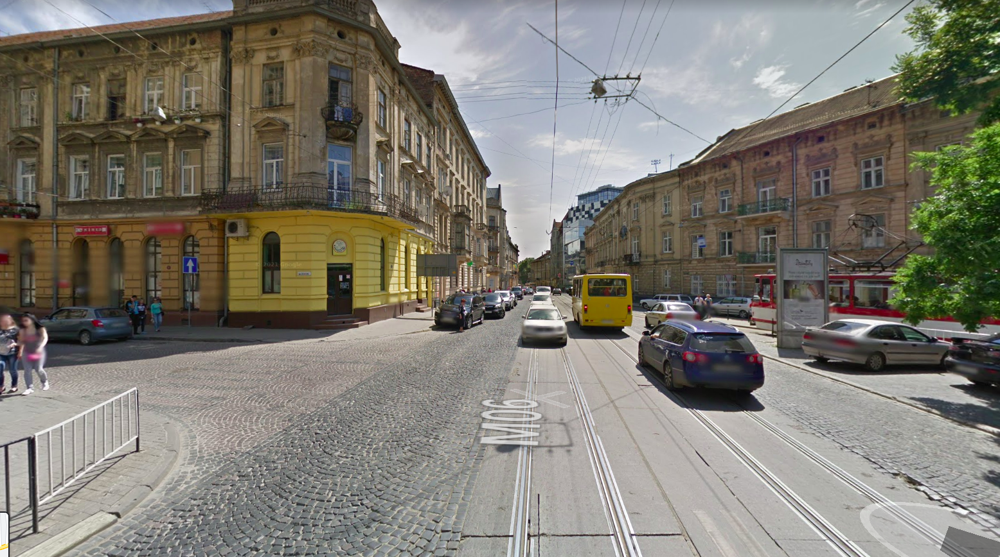
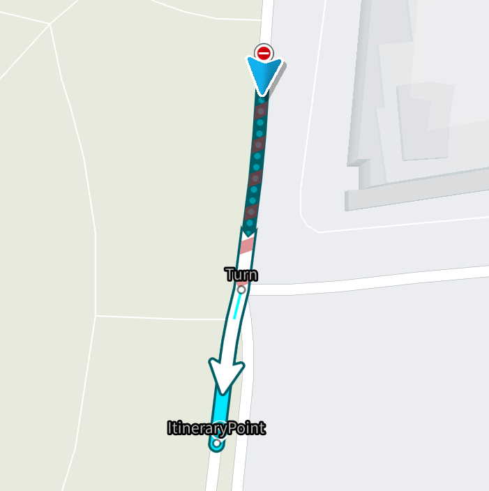
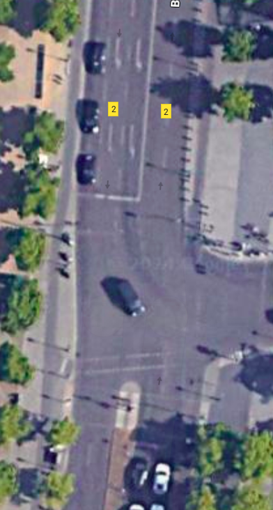
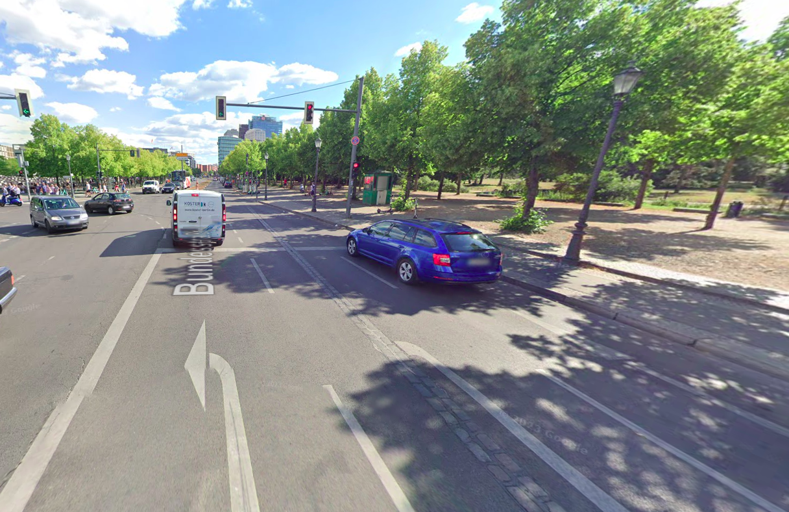
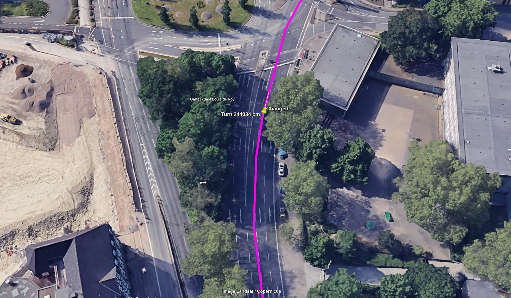
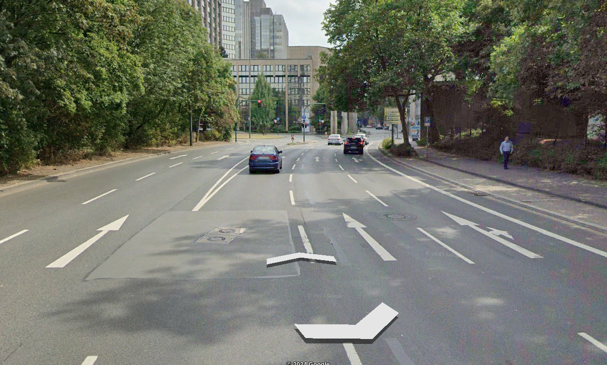

// Copyright (C) 2022 TomTom NV. All rights reserved.
//
// This software is the proprietary copyright of TomTom NV and its subsidiaries and may be
// used for internal evaluation purposes or commercial use strictly subject to separate
// license agreement between you and TomTom NV. If you are the licensee, you are only permitted
// to use this software in accordance with the terms of your license agreement. If you are
// not the licensee, you are not authorized to use this software in any manner and should
// immediately return or destroy it.

= SimpleTurnHandler

A `SimpleTurnHandler` is designed to handle simple turns.
A simple turn is a maneuver that involve a single junction.
On the other hand, a complex turn involves more than one junction.
It issues a turn instruction in all cases, except xref:natural_continuation/intersections.adoc[natural continuation]. +
A turn with a straight direction is also considered a simple turn and is issued when a straight continuation is not obvious,
such cases are being detected by involving a link:./detectors/cross_ambiguous_multilane_intersection_detector.adoc[CrossAmbiguouosMultilaneIntersectionDetector]. +
Should be used as a fallback, when no other situation handlers apply.

== Example #1

Location: *49.83822,24.03524* +
A driver is driving from the North to the South-East and going to perform a left turn. +
Since, in the situation depicted below:

* no roundabouts
* no merges
* no controlled access
* no forks
* no complex intersections
* no auto transports
* no link:./street_join_handler.adoc[street joins]

A `SimpleTurnHandler` takes place and issues a turn left instruction.

=== The actual route

=== The situation from the satellite

=== The situation from the driver's perspective

== Example #2

Location: *52.51457, 13.37736* +
A driver is driving Ebertstraße from the North to the South. +
There are three lanes at the intersection: two lanes turn left, one lane goes straight. +
Since the rightmost lane is the only one that allows straight continuation, a go-straight(turn with a straight direction) instruction is issued to make sure the driver will not end up in the wrong lane at intersection.

=== The actual route

=== The situation from the satellite

=== The situation from the driver's perspective

== Example #3

Location: *51.4550954, 7.0160955* +
A driver is traveling southwards on Bernestraße. +
The route has a bifurcation, with both diverging lanes proceeding straight ahead. +
Due to the similarity of both outgoing lanes moving in a straight direction, the driver may get confused if the instruction is "Continue Straight", which could lead to the wrong lane being chosen. +
In this situation, the voice guidance provided would be "Slight Right". +
This is because the route through the bifurcation contains a special transition code "BARE" and both outgoing lines continue in the straight direction.

=== The situation from the satellite

=== The situation from the driver's perspective

== Relations with other situation handlers

Any situation handler, except `EndOfRoadUTurnHandler` and `BorderCrossingHandler` has priority only over `SimpleTurnHandler`.
