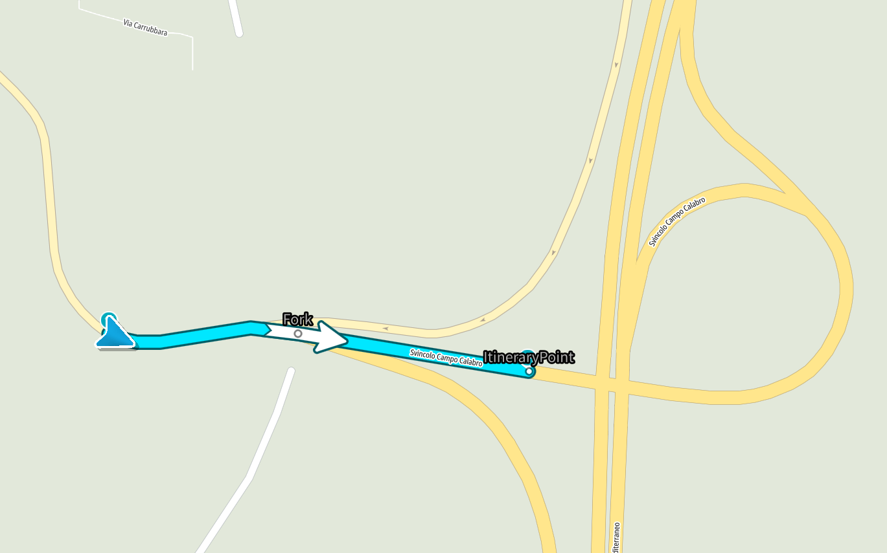
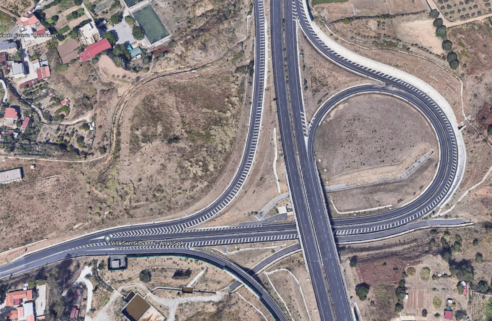
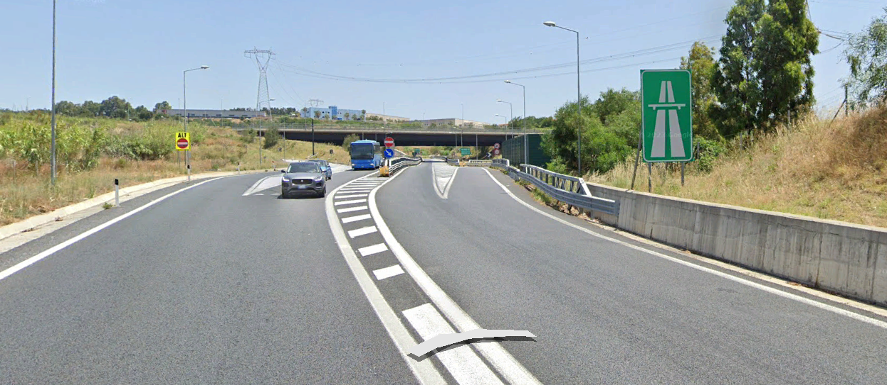

// Copyright (C) 2023 TomTom NV. All rights reserved.
//
// This software is the proprietary copyright of TomTom NV and its subsidiaries and may be
// used for internal evaluation purposes or commercial use strictly subject to separate
// license agreement between you and TomTom NV. If you are the licensee, you are only permitted
// to use this software in accordance with the terms of your license agreement. If you are
// not the licensee, you are not authorized to use this software in any manner and should
// immediately return or destroy it.

= SplitOfRampsForkHandler

Some bifurcations with a split of ramps (usually motorway entering) may have similar geometry to a fork, but we consider such cases as not a fork because such bifurcations don't meet conditions of either motorway fork or city fork. +
Also, sometimes such cases could be even considered as a natural continuation. +
It could be not so obvious on the road. +
Such cases are fixed by adding the `SplitOfRampsForkHandler` for handling the split of ramps on the road when any of the ramps leads to the motorway.

`SplitOfRampsForkHandler` is designed to handle the bifurcations when the road splitting has distinct ramps that still could be handled as a fork.

== Issue a fork instruction

* if both outgoing lines require no more than moderate steering actions
* if both outgoing lines are ramps
* if at least one ramp leads to the motorway

== Do not issue a fork instruction

* If the outgoing arcs constitute the start of a plural junction intersection.
* If the bifurcation under consideration can be perceived as a natural continuation (NC) based on one of two conditions:
** NC based on Lane data, as highlighted in cases #1 - #4 from the xref:./natural_continuation/bifurcations.adoc[bifurcation] document.
** NC is based on data from the routing building block (when the administrative road class of the outgoing line on the route is noticeably higher than the alternative).

== Relations with other situation handlers

A `SplitOfRampsForkHandler` should take precedence over the `MotorwayForkHandler`, since the split of ramps may occur on motorway forks and requires special handling. +
A `SplitOfRampsForkHandler` should be prioritized over the `ForkHandler`. +
This is due to the fact that the ForkHandler is more generic and should not consider the forks at split of ramps.

== Example

Location: *38.204806, 15.638750* +
A driver is driving from West to East and going to enter a motorway. +
A `SplitOfRampsForkHandler` takes place and issues a fork left instruction.

=== The actual route

=== The situation from the satellite

=== The situation from the driver's perspective

