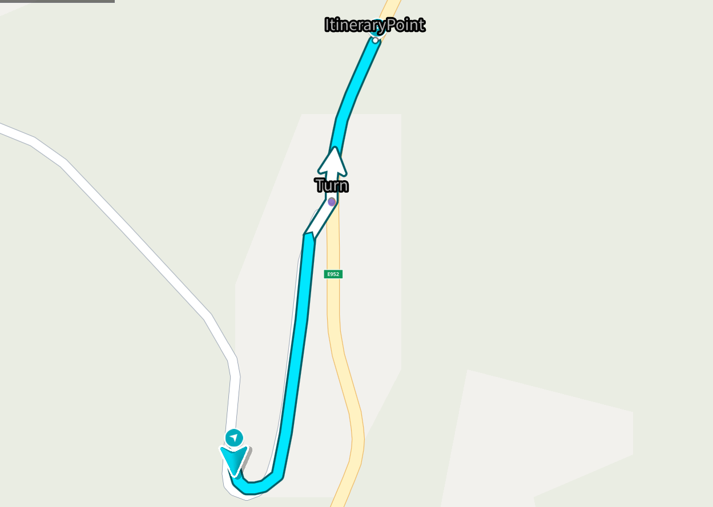
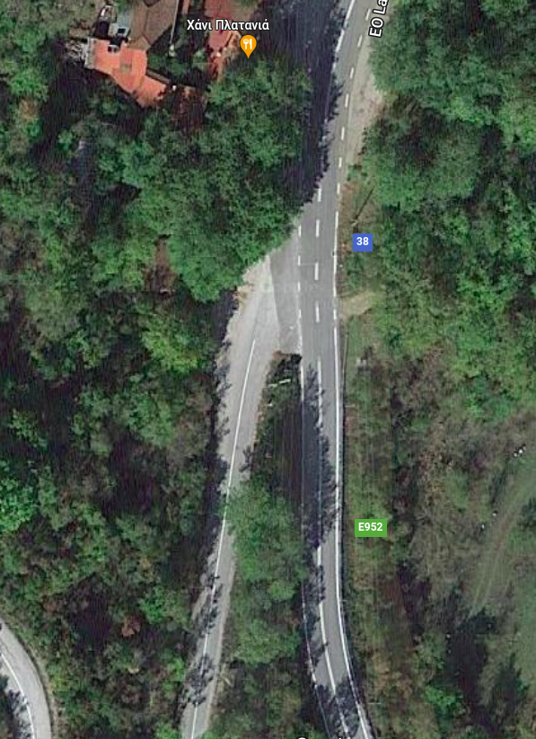
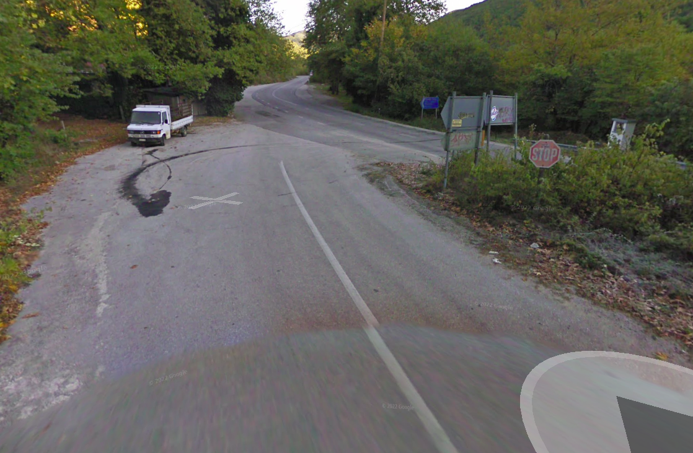
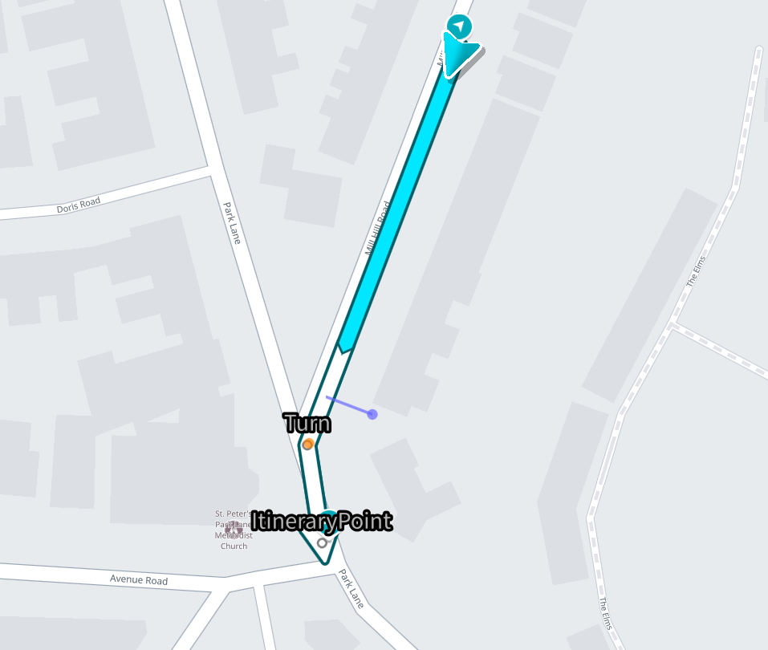
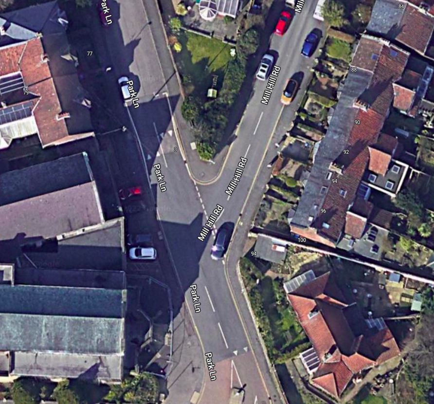
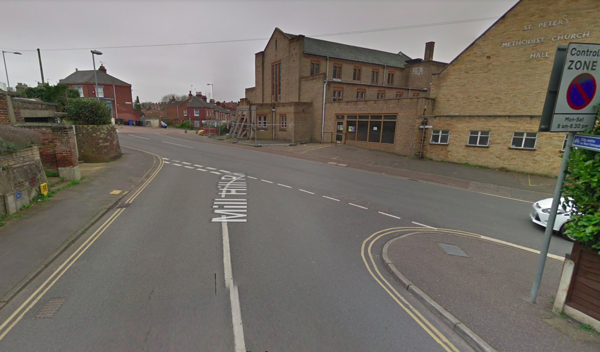
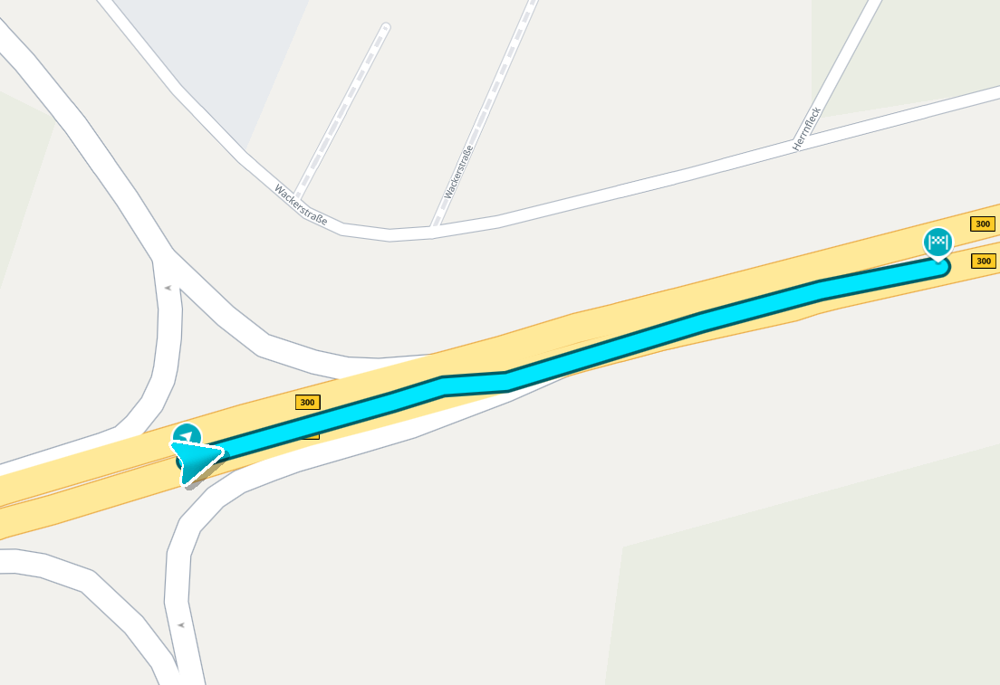
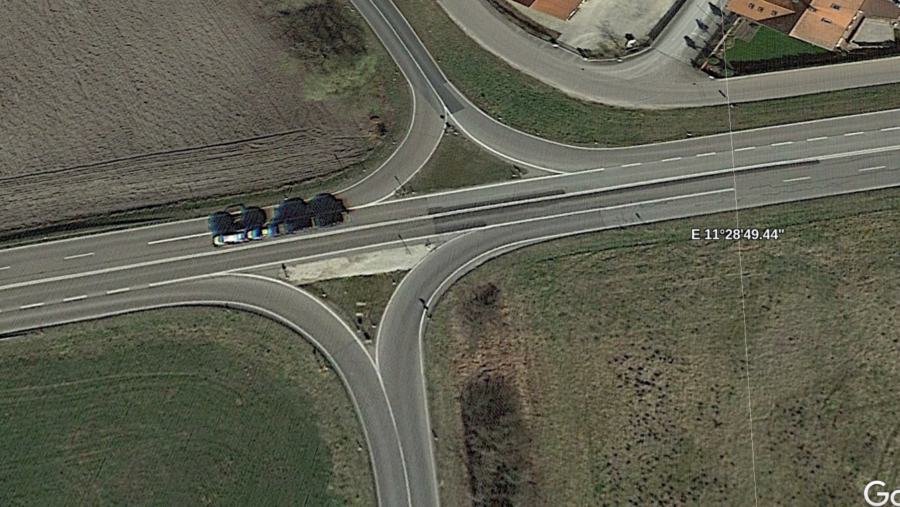
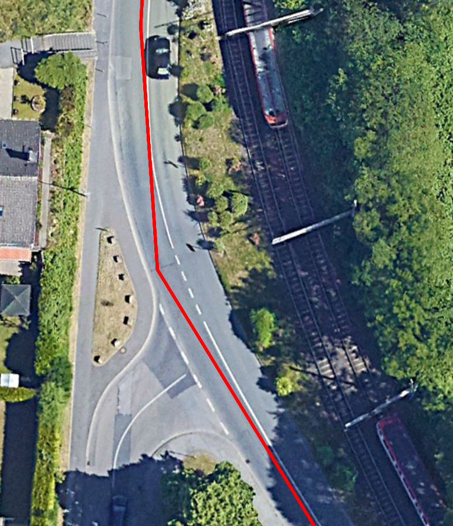
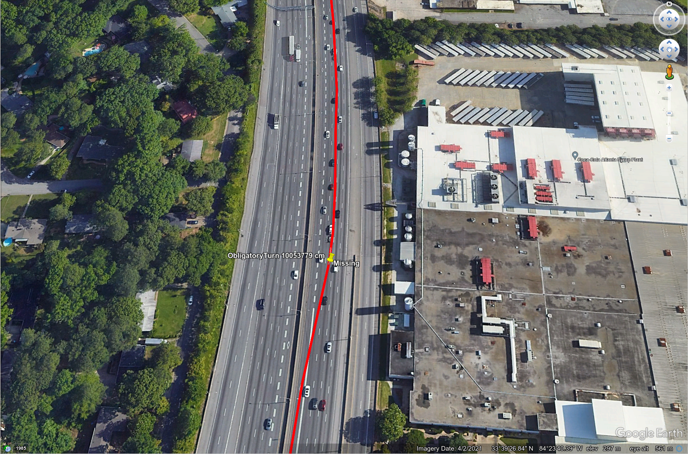

// Copyright (C) 2022 TomTom NV. All rights reserved.
//
// This software is the proprietary copyright of TomTom NV and its subsidiaries and may be
// used for internal evaluation purposes or commercial use strictly subject to separate
// license agreement between you and TomTom NV. If you are the licensee, you are only permitted
// to use this software in accordance with the terms of your license agreement. If you are
// not the licensee, you are not authorized to use this software in any manner and should
// immediately return or destroy it.

= StreetJoinHandler

A `StreetJoinHandler` is designed to handle road situations where one street joins another. +
A turn instruction will be issued if a street join situation is detected. +
A street join is a bent T-junction (three-way junction, where outgoing lines form a "head of T"), where the route doesn't bend much.
Typically, it is visually simple to distinguish between the "head of the T" and the "tail of the T" roads.
The former frequently have identical names, road numbers, or administrative classifications. Meanwhile, the latter
typically has less important administrative class.
Other usual case is when side road ("tail of the T") merging to a main road. This can be easily identified by the ALONG_MAIN_ROAD special transition code or the presence of a "Yield" sign. +
In such cases, even that the situation may seem like a natural continuation, instruction is needed anyway,
since the driver should either cross the oncoming traffic or give way to other cars in order to merge into the new street.

Examples of street join are depicted below.

== Street Join #1

Location: *38.93090,21.92923* +
The driver is going to join a new street while crossing the oncoming traffic.

=== 1.1 The actual route

=== 1.2 The situation from the satellite

=== 1.3 The situation from the driver's perspective

== Street Join #2

Location: *52.626430,1.276790* +
The driver can join a new street only after giving a way to other cars.

=== 2.1 The actual route

=== 2.2 The situation from the satellite

=== 2.3 The situation from the driver's perspective

== Relations with other situation handlers

A `StreetJoinHandler` should has a priority over a link:simple_turn_handler.adoc[SimpleTurnHandler], since the latter can accidentally suppress the instruction, because it treats a street join as a natural continuation.

Street joins should not be messed up with merges.
A `StreetJoinHandler` is designed to be used in the cities, whereas `MergeHandler` is designed to be used on the motorways.
This is why `MergeHandler` should has a priority over a `StreetJoinHandler`.

== What is not a street join?

=== Case #1: off-route road is a ramp

Location: *48.64892,11.48043* +
Ramp or slip road joins the main road.

=== The actual route

=== The situation from the satellite

A main road joins the ramp.

=== Case #2: driving more important road

=== The situation from the satellite with the route

An on-route road is a more important road (a road which has more important admin class) or main road.

=== Case #3 Both on-route and off-rote roads are motorways
Location: *33.6576891,-84.3946928* +
HOV lanes joins the motorway as HOV lane

=== The situation from a satellite

