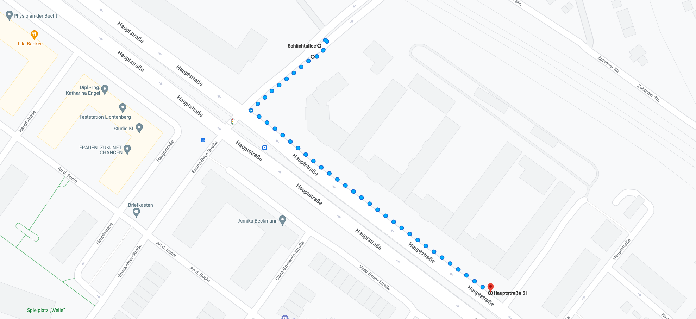
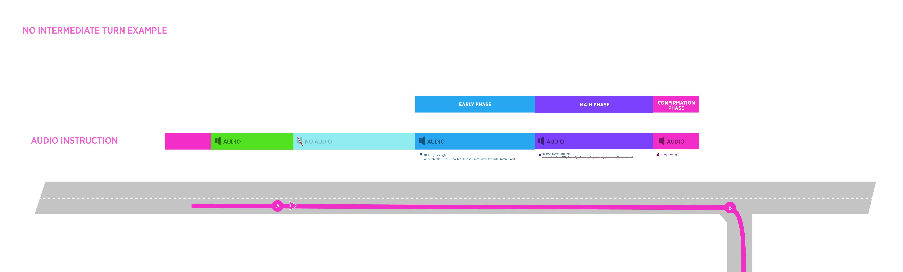

<table class="wrapped confluenceTable"><colgroup><col style="width: 171.0px;"></colgroup><colgroup><col style="width: 199.0px;"></colgroup><tbody><tr><th class="highlight-grey confluenceTh" colspan="1" data-highlight-colour="grey">Status</th><td colspan="1" class="confluenceTd">

DONE

</td></tr><tr><th colspan="1" class="confluenceTh"><strong>Interaction Designer</strong></th><td colspan="1" class="confluenceTd">

<a class="confluence-userlink user-mention" data-account-id="712020:73555e9b-dcfa-442b-80ec-98ad0ea3d941" href="https://tomtom.atlassian.net/wiki/people/712020:73555e9b-dcfa-442b-80ec-98ad0ea3d941?ref=confluence" target="_blank" data-base-url="https://tomtom.atlassian.net/wiki">Former user (Deleted)</a> 

</td></tr><tr><th colspan="1" class="confluenceTh"><strong>Visual Designer</strong></th><td colspan="1" class="confluenceTd">
<a class="confluence-userlink user-mention" data-account-id="5be2fd44649a737c2342afbe" href="https://tomtom.atlassian.net/wiki/people/5be2fd44649a737c2342afbe?ref=confluence" target="_blank" data-linked-resource-id="22090465" data-linked-resource-version="1" data-linked-resource-type="userinfo" data-base-url="https://tomtom.atlassian.net/wiki">Georgios Koultouridis</a>
</td></tr><tr><th colspan="1" class="confluenceTh">PM</th><td colspan="1" class="confluenceTd">

 

</td></tr></tbody></table>

Table of Contents
=================

/\*<!\[CDATA\[\*/ div.rbtoc1729237217396 {padding: 0px;} div.rbtoc1729237217396 ul {list-style: disc;margin-left: 0px;} div.rbtoc1729237217396 li {margin-left: 0px;padding-left: 0px;} /\*\]\]>\*/

* [Table of Contents](#Isolatedturn-TableofContents)
    * [General goal](#Isolatedturn-Generalgoal)
    * [Specific goal](#Isolatedturn-Specificgoal)
    * [What is Isolated turn?](#Isolatedturn-WhatisIsolatedturn?)
    * [Conditions for Isolated turn](#Isolatedturn-ConditionsforIsolatedturn)
    * [Examples](#Isolatedturn-Examples)

**General goal**
----------------

Make audio annoucements more digestible

**Specific goal**
-----------------

Reduce the details of the audio announcement (street name + Towards) on _Isolated turn_ for Early and Main phase audio triggering logic

**What is Isolated turn?**
--------------------------

Isolated turn is a road network scenario where there are no intermediate turns between the driver and the target manoeuvre.

It can be conceptualise as an 'obvious turn' and this why audio announcement can be simplified.

**Conditions for Isolated turn**
--------------------------------

* this applies to all road types except for controlled access roads

* there are not intermediate turns between the driver and the target manoeuvre

* or there are intermediate turns but the distance between the first turn and the target turn is >= 100m

When these conditions are true, the system will not announce:

* street name
* towards information 

**Examples**
------------

Take a look at a real scenario **[here](https://www.google.de/maps/dir/52.4995286,13.4814377/52.4981261,13.4830352/@52.4988863,13.4822696,18.71z/data=!4m9!4m8!1m5!3m4!1m2!1d13.4813768!2d52.4994665!3s0x47a84ee6780e9325:0x980c4cbc8700444e!1m0!3e2)** (Google Maps)

**No Intermediate turn**

* My new comment
* There are no other turns in between you and the turn

**Intermediate turn**

* You are driving on a long-straight road and you need to turn right...
* there are intermediate turns but the distance between the first turn and the target turn is >= 100m

This is a new turn....
