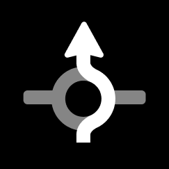
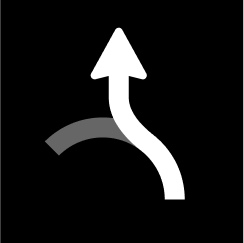

Visual Instruction represents Roundabout schematically.

| **First exit**     | **Third exit**     | **cross, second exit** | **take fifths exit** | **exit roundabout** |
| ------------------ | ------------------ | ---------------------- | -------------------- | ------------------- |
|  |  |      |    |   |

There are use cases when exit instruction doesn't have place. Those happen usually due to close proximity of the entry and exit points. They are so close to each other that can be considered as one.

Roundabouts types
=================

Different configurations of roundabouts require different instruction compositions, therefore, we define separately following categories of roundabouts: