<table data-table-width="918" data-layout="align-start" data-local-id="113efb3d-119d-4430-9dea-9485d8b0e341" class="confluenceTable"><colgroup><col style="width: 185.0px;"><col style="width: 733.0px;"></colgroup><tbody><tr><th class="confluenceTh">
<strong>IXD</strong>
</th><td class="confluenceTd">
<a class="confluence-userlink user-mention" data-account-id="70121:e8cb7861-9079-4b92-b96d-bfe8cd882680" href="https://tomtom.atlassian.net/wiki/people/70121:e8cb7861-9079-4b92-b96d-bfe8cd882680?ref=confluence" target="_blank" data-linked-resource-id="22153071" data-linked-resource-version="1" data-linked-resource-type="userinfo" data-base-url="https://tomtom.atlassian.net/wiki">Alexey Opokin</a>
</td></tr><tr><th class="confluenceTh">
<strong>VD</strong>
</th><td class="confluenceTd">
<a class="confluence-userlink user-mention" data-account-id="5be2fd44649a737c2342afbe" href="https://tomtom.atlassian.net/wiki/people/5be2fd44649a737c2342afbe?ref=confluence" target="_blank" data-linked-resource-id="22090465" data-linked-resource-version="1" data-linked-resource-type="userinfo" data-base-url="https://tomtom.atlassian.net/wiki">Georgios Koultouridis</a>
</td></tr><tr><th class="confluenceTh">
<strong>ENG. OWNER</strong>
</th><td class="confluenceTd">
<a class="confluence-userlink user-mention" data-account-id="712020:27737e77-b2fa-4ca4-9fbf-019cbab57789" href="https://tomtom.atlassian.net/wiki/people/712020:27737e77-b2fa-4ca4-9fbf-019cbab57789?ref=confluence" target="_blank" data-linked-resource-id="22087847" data-linked-resource-version="1" data-linked-resource-type="userinfo" data-base-url="https://tomtom.atlassian.net/wiki">Agnieszka Sobczyk</a>
</td></tr><tr><th class="confluenceTh">
<strong>PM</strong>
</th><td class="confluenceTd">
<a class="confluence-userlink user-mention" data-account-id="712020:a6d50cb1-97be-4a9a-a279-3fbb3e2e1799" href="https://tomtom.atlassian.net/wiki/people/712020:a6d50cb1-97be-4a9a-a279-3fbb3e2e1799?ref=confluence" target="_blank" data-linked-resource-id="22151595" data-linked-resource-version="1" data-linked-resource-type="userinfo" data-base-url="https://tomtom.atlassian.net/wiki">Joost Pennings</a> 
</td></tr><tr><th class="confluenceTh">
<strong>TICKET</strong>
</th><td class="confluenceTd">
<a href="https://jira.tomtomgroup.com/browse/NAV-131044?src=confmacro">NAV-131044</a> - Unable to retrieve issue. You don't have permission or need to <a href="https://tomtom.atlassian.net/wiki/plugins/servlet/applinks/oauth/login-dance/authorize?applicationLinkID=d8fe222a-fe17-3dd8-96f3-0293f0a69f83" class="static-oauth-init">authenticate</a>
</td></tr></tbody></table>

Introduction
============

This is a revision of the original design. As  a result of the evaluation of Roundabouts instructions we received the following feedback:

<table data-table-width="932" data-layout="align-start" data-local-id="90863d32-7a44-4447-a407-6180cb0dfd81" class="confluenceTable"><colgroup><col style="width: 547.0px;"><col style="width: 384.0px;"></colgroup><tbody><tr><th class="confluenceTh">
<strong>Issue</strong>
</th><th class="confluenceTh">
<strong>Possible solution</strong>
</th></tr><tr><td class="confluenceTd">
Turn directions (turn right/ left) often reported as wrong/misleading. Turns only work in narrow range scenarios
</td><td class="confluenceTd">
Remove turn directions at roundabouts 
</td></tr><tr><td class="confluenceTd">
Turn directions for big roundabouts are useless, as driver loses original perspective while driving along the curve.
</td><td class="confluenceTd">
Remove turn directions at roundabouts 
</td></tr><tr><td class="confluenceTd">
Lane guidance is misleading on a big roundabouts
</td><td class="confluenceTd">
Provide SLG design for multi-lane roundabouts
</td></tr><tr><td class="confluenceTd">
Exit Roundabout instruction is not clear. 
</td><td class="confluenceTd">
Clarify exit instruction
</td></tr></tbody></table>

Roundabouts are complicated intersection type that require special instruction for handling. Typically driving through roundabouts poses following challenges: It is not easy to identify correct exit, especially if there are many and directions are not straight. The challenge is amplified by the fact that decision should be made very fast. To address this we must prepare the driver upfront and provide him necessary information that could be applied instantly. Typical method of guidance trough roundabouts is mentioning the **number of exit** (counted from the entry point) that has to be taken. It is relatively easy to count exits for the driver, however this could be complicated if exits are mixed up with entries. It is not always easy to distinguish entries from exits especially when it needs to be done very fast during counting.

Roundabout Instruction Architecture
===================================

Unlike, general instruction template, roundabout manoeuvre doesn't take place at one point but has a stretch of the road with two key points: entry and exit. To reflect this, the instruction has different architecture and consists of two parts:

**Entry Roundabout instruction** - Given for the entry as a manoeuvre point. Instructs how to perform whole Roundabout manoeuvre from entry to exit. 
**Exit roundabout instruction** - Given for the exit as manoeuvre point. Only instructs how to perform the exit roundabout manoeuvre, while being already on the roundabout.

**Roundabout Instruction schematic diagram.**
Technically, Roundabout manoeuvre is a sequence of two independent manoeuvres: **Roundabout entry** and **Roundabout Exit**  reference point for the entry is entry point and for the exit - exit. Those two manoeuvres have associated with them instructions which are depicted in corresponding Blue and Green colors on the diagram above.

Next Instruction panel
----------------------

Design of Next instruction panel and Audio announcement depends on lane configuration at the roundabout, therefore we will be covering **single-lane** roundabouts and **multi-lane** separately.

**Single lane roundabout instruction design**

<table data-table-width="1456" data-layout="align-start" data-local-id="0d34d1b8-caaa-42bf-8642-7dc51d7f622b" class="confluenceTable"><colgroup><col style="width: 126.0px;"><col style="width: 452.0px;"><col style="width: 507.0px;"><col style="width: 369.0px;"></colgroup><tbody><tr><th class="confluenceTh">
<strong>Phase</strong>
</th><th class="confluenceTh">
<strong>Visual</strong>
</th><th class="confluenceTh">
<strong>Audio</strong>
</th><th class="confluenceTh">
<strong>Notes</strong>
</th></tr><tr><td class="confluenceTd">
Early
</td><td class="confluenceTd">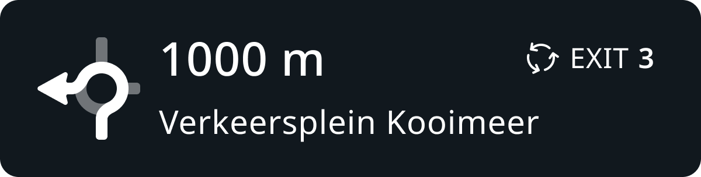</td><td class="confluenceTd">
<em><strong>In one kilometer, at the Roundabout, take the 3rd exit ...</strong></em>
</td><td class="confluenceTd">

</td></tr><tr><td class="confluenceTd">
Main
</td><td class="confluenceTd"></td><td class="confluenceTd">
<em><strong>In four hundred meters, at the Roundabout, take the 3rd exit ...</strong></em>
</td><td class="confluenceTd">

</td></tr><tr><td class="confluenceTd">
Conf
</td><td class="confluenceTd"></td><td class="confluenceTd">
<em><strong>take the 3rd exit</strong></em>
</td><td class="confluenceTd">
At the point of entry the distance counter gets down to 0 and then after entering roundabout, immediately restarts with the distance til the exit point.
</td></tr><tr><td class="confluenceTd">
Exit
</td><td class="confluenceTd">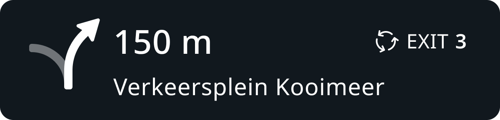</td><td class="confluenceTd">
<em><strong>exit the roundabout</strong></em>
</td><td class="confluenceTd">
Exit instructions don't mention the number of exit since it is not applicable for the current position of the vehicle
</td></tr></tbody></table>

**Multi-lane roundabout instruction design**

<table data-table-width="1490" data-layout="align-start" data-local-id="26723659-47e8-42dc-b5bd-093233ff025a" class="confluenceTable"><colgroup><col style="width: 110.0px;"><col style="width: 483.0px;"><col style="width: 448.0px;"><col style="width: 448.0px;"></colgroup><tbody><tr><th class="confluenceTh">
<strong>Phase</strong>
</th><th class="confluenceTh">
<strong>Visual</strong>
</th><th class="confluenceTh">
<strong>Audio</strong>
</th><th class="confluenceTh">
<strong>Notes</strong>
</th></tr><tr><td class="confluenceTd">
Early
</td><td class="confluenceTd">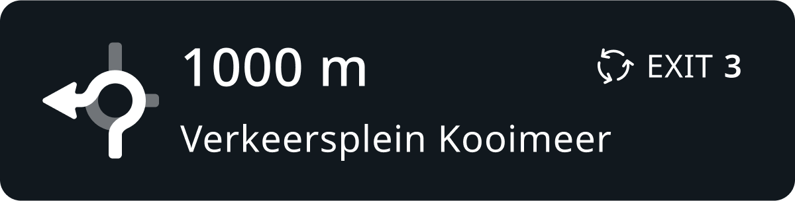</td><td class="confluenceTd">
<em><strong>In one kilometer, at the Roundabout, take the 3rd exit ...</strong></em>
</td><td class="confluenceTd">

</td></tr><tr><td class="confluenceTd">
Main
</td><td class="confluenceTd">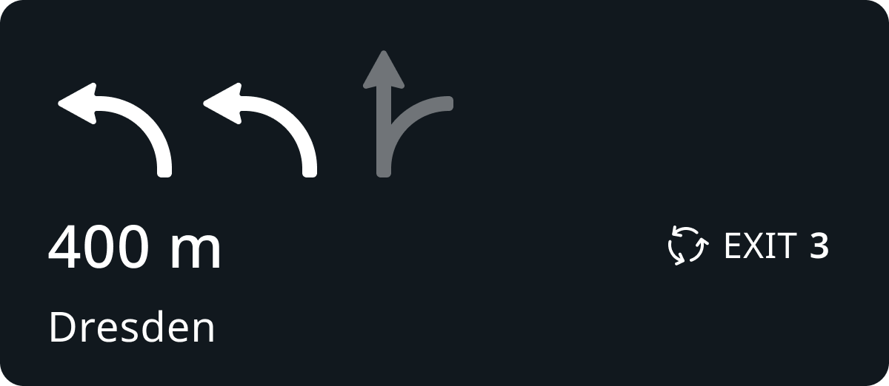</td><td class="confluenceTd">
<em><strong>In four hundred meters, at the Roundabout, stay in the left two lanes to take the 3rd exit ...</strong></em>
</td><td class="confluenceTd">
New design of Unified SLG replaces manoeuvre arrow with SLG at main, Confirmation instruction phases. SLG here depicts lane configuration at the entrance to the roundabout.
</td></tr><tr><td class="confluenceTd">
Confirmation
</td><td class="confluenceTd">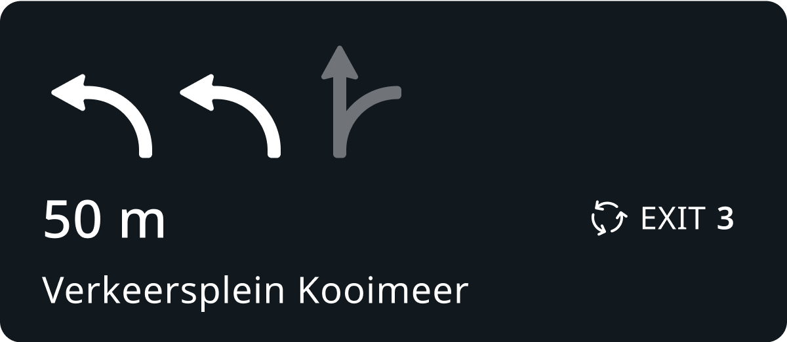</td><td class="confluenceTd">
<em><strong>take the 3rd exit</strong></em>
</td><td class="confluenceTd">
At the point of entry the distance counter gets down to 0 and then after entering roundabout, immediately restarts with the distance til the exit point.
</td></tr><tr><td class="confluenceTd">
Exit
</td><td class="confluenceTd">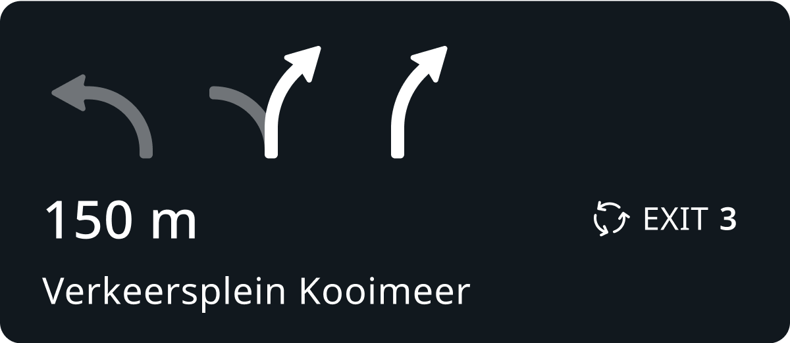</td><td class="confluenceTd">
<em><strong>exit the roundabout</strong></em>
</td><td class="confluenceTd">
New design of Unified SLG replaces manoeuvre arrow with SLG at main, Confirmation instruction phases. SLG here depicts lane configuration at the exit point from the roundabout.
</td></tr></tbody></table>

### SLG logic for multi-lane roundabouts

Multi-lane roundabouts lane recommendation should be gathered from lane connectivity data. Typically, the rightmost lane is connected with the first exit. Second and third to the second exit. Leftmost lane to the 3rd and further exits. This principle, however, could be broken and lane connectivity In those cases the only way to know which lane should be recommended is to read lane markings which are usually drawn on the surface of the road. Generally, when lane connectivity is in place it should be used for gathering recommended lane. And only when all lanes are connected to the target exit equally, we should apply generic lane logic.

**Generic Lane Logic**

<table data-table-width="936" data-layout="align-start" data-local-id="fc379a31-daad-46e9-a5e8-d5f971486547" class="confluenceTable"><colgroup><col style="width: 122.0px;"><col style="width: 282.0px;"><col style="width: 531.0px;"></colgroup><tbody><tr><th class="confluenceTh">
<strong>Exit number</strong>
</th><th class="confluenceTh">
<strong>Recommended lane</strong>
</th><th class="confluenceTh">
<strong>Notes</strong>
</th></tr><tr><td class="confluenceTd">
1
</td><td class="confluenceTd">
Rightmost
</td><td class="confluenceTd">

</td></tr><tr><td class="confluenceTd">
2
</td><td class="confluenceTd">
2nd from the right
</td><td class="confluenceTd">

</td></tr><tr><td class="confluenceTd">
3
</td><td class="confluenceTd">
2nd or/and 3rd from the right
</td><td class="confluenceTd">
3rd - if third lane is available
</td></tr><tr><td class="confluenceTd">
4 - max
</td><td class="confluenceTd">
Leftmost
</td><td class="confluenceTd">

</td></tr></tbody></table>

NOTE: this table is defined for standard driving road side (not UK, Japan). For those regions the side should be reversed.

**Example**

Following example illustrates lane guidance at multi-lane roundabout with 2 exits. Roundabout itself consists of 2 lanes that are not marked on the circle but assumed to be there because ther are 2 lanes at the entrance of the roundabout.

**Instruction modelling for this scenario**

<table data-table-width="1220" data-layout="align-start" data-local-id="d64e6b0d-1624-4124-9148-3355d1564c6e" class="confluenceTable"><colgroup><col style="width: 80.0px;"><col style="width: 281.0px;"><col style="width: 273.0px;"><col style="width: 586.0px;"></colgroup><tbody><tr><th class="confluenceTh">
<strong>Exit No.</strong>
</th><th class="confluenceTh">
<strong>NIP</strong>
</th><th class="confluenceTh">
<strong>Audio</strong>
</th><th class="confluenceTh">
<strong>Notes</strong>
</th></tr><tr><td class="confluenceTd">
1
</td><td class="confluenceTd">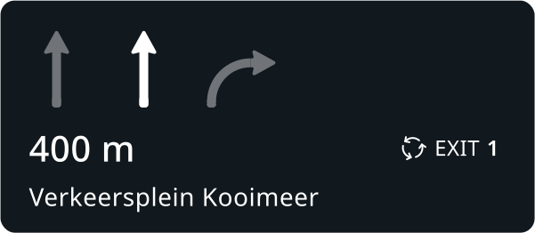</td><td class="confluenceTd">
Stay in the middle lane to take the first exit…
</td><td class="confluenceTd">
Even though, it possible to change lanes while driving along the circle - it is not optimal. Therefore using our MPO (manoeuvre path optimisation) method we recommend the most optimal lane that doesn't require lane changes.
</td></tr><tr><td class="confluenceTd">
2
</td><td class="confluenceTd"></td><td class="confluenceTd">
Stay in the left two lanes to take the second exit….
</td><td class="confluenceTd">
Both left lanes are equally optimised for the second exit, therefore both are recommended
</td></tr></tbody></table>

### Roundabout manoeuvre arrow

Visual Instruction represents Roundabout schematically.

<table data-table-width="1417" data-layout="align-start" data-local-id="0a41c2d1-1473-46bc-8215-559d6432f386" class="confluenceTable"><colgroup><col style="width: 285.0px;"><col style="width: 283.0px;"><col style="width: 283.0px;"><col style="width: 283.0px;"><col style="width: 283.0px;"></colgroup><tbody><tr><td data-highlight-colour="#000000" class="confluenceTd">
<strong>First exit</strong>
</td><td data-highlight-colour="#000000" class="confluenceTd">
<strong>Third exit</strong>
</td><td data-highlight-colour="#000000" class="confluenceTd">
<strong>cross, second exit</strong>
</td><td data-highlight-colour="#000000" class="confluenceTd">
<strong>take fifths exit</strong>
</td><td data-highlight-colour="#000000" class="confluenceTd">
<strong>exit roundabout</strong>
</td></tr><tr><td data-highlight-colour="#000000" class="confluenceTd">

</td><td data-highlight-colour="#000000" class="confluenceTd"></td><td data-highlight-colour="#000000" class="confluenceTd">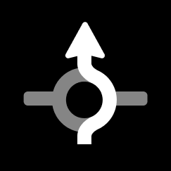</td><td data-highlight-colour="#000000" class="confluenceTd">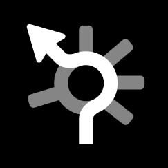</td><td data-highlight-colour="#000000" class="confluenceTd">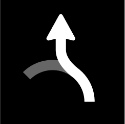</td></tr></tbody></table>

When Exit instruction is omitted?
---------------------------------

There are use cases when exit instruction doesn't have place. Those happen usually due to close proximity of the entry and exit points. They are so close to each other that can be considered as one.

<table data-table-width="1219" data-layout="align-start" data-local-id="f3ef09e9-b565-4e82-ad31-aba907e1fa6b" class="confluenceTable"><colgroup><col style="width: 218.0px;"><col style="width: 296.0px;"><col style="width: 700.0px;"></colgroup><tbody><tr><th class="confluenceTh">
<strong>Type</strong>
</th><th class="confluenceTh">
<strong>Diagram</strong>
</th><th class="confluenceTh">
<strong>Notes</strong>
</th></tr><tr><td class="confluenceTd">
First exit to the right
</td><td class="confluenceTd">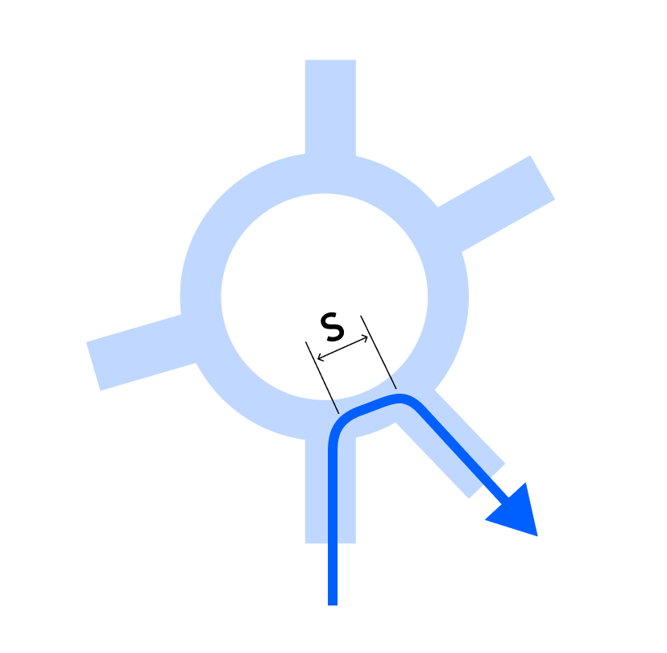</td><td class="confluenceTd">
In typical roundabout geometry (but not always), the first exit goes to the right. That puts it in the position which is very close to the entry. Naturally, there is no time for the exit instruction ion this case. Similarly to "Small Roundabouts" handling, in this scenario, exit instruction should be omitted.
</td></tr><tr><td class="confluenceTd">
Small Roundabout
</td><td class="confluenceTd">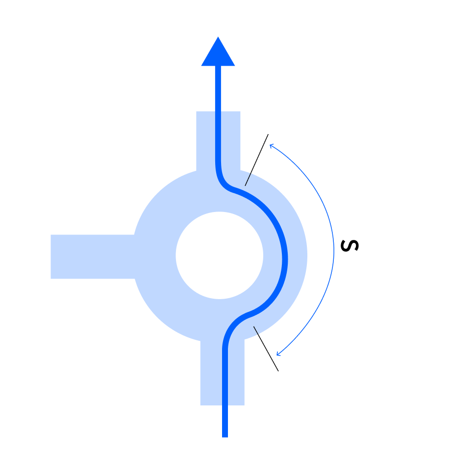</td><td class="confluenceTd">
It could happen (usually on small roundabouts) that distance of traveling along the curve (S) could be so small that it will not leave enough time for exit instruction to be announced. For this scenario we should have a method of skipping the exit instruction if time is not sufficient for it. Threshold of travel distance from entry to exit should be defined. Initial value is: ~80m (is it correct value?). To be refined experimentally while driving through small roundabouts.
</td></tr></tbody></table>

Roundabouts types
=================

Different configurations of roundabouts require different instruction compositions, therefore, we define separately following categories of roundabouts:

1. **Small / Straight roundabouts** \- the most trivial traffic figures that require minimal instruction for the manoeuvre.
2. **Single lane roundabouts (excluding #1) -** the most common traffic figures that require moderate instruction for the manoeuvre.
3. **Multi-lane roundabouts -** the most complex traffic figures that require the most elaborative instruction for the manoeuvre.

1\. Small / straight roundabouts
--------------------------------

Small, straight (both conditions must be present to be classified as such) roundabout are trivial intersections and when crossing, don't require too elaborative instruction. Generic roundabout instruction is long and might be annoying especially if repeated in serial scenarios which are common for small roundabouts, therefore we use more natural format for such scenarios. We rely on _**cross the roundabout**_ when going straight and _**go around the roundabout**_ when going back. Street names announcements are also minimised at those traffic figures.

**Small, Straight Roundabouts detection algorithms** TO BE MOVED TO GITHUB

This sections should be moved to the GitHub and managed by _**engineering owner**_.

Detection of Small Roundabout

Small roundabouts must have less than 30m radius. Angle deviations from 90° should not exceed +-5° (both sides)

<table data-table-width="865" data-layout="align-start" data-local-id="486b34d9-f0ee-49b9-9f96-d198f0dda870" class="confluenceTable"><colgroup><col style="width: 48.0px;"><col style="width: 187.0px;"><col style="width: 495.0px;"></colgroup><tbody><tr><th class="confluenceTh">
<strong>ID</strong>
</th><th class="confluenceTh">
<strong>Road Network</strong>
</th><th class="confluenceTh">
<strong>Description</strong>
</th></tr><tr><td class="confluenceTd">
#1
</td><td class="confluenceTd"></td><td class="confluenceTd">
This is a small (supposedly less than 30m radius) roundabout with clear straight exits.
</td></tr><tr><td class="confluenceTd">
#2
</td><td class="confluenceTd"></td><td class="confluenceTd">
Two successive roundabout: one of them is small and another is big. For small one we should use short version and for big one - normal.
</td></tr><tr><td class="confluenceTd">
#3
</td><td class="confluenceTd"></td><td class="confluenceTd">
This roundabout while small,<strong> is not straight</strong>, therefore id doesn't meet straight direction conditions.
</td></tr></tbody></table>

**Detection of straight direction.**

Straight direction for small roundabouts is identified from looking at the following attributes:

<table data-table-width="1800" data-layout="full-width" data-local-id="32182045-d0b9-4b22-a49f-0619c256d25b" class="confluenceTable"><colgroup><col style="width: 106.0px;"><col style="width: 48.0px;"><col style="width: 576.0px;"></colgroup><tbody><tr><th class="confluenceTh">
<strong>Attribute</strong>
</th><th class="confluenceTh">
<strong>Value</strong>
</th><th class="confluenceTh">
<strong>Description</strong>
</th></tr><tr><td class="confluenceTd">
Multilane roundabouts
</td><td class="confluenceTd">
Yes / No
</td><td class="confluenceTd">
Multilane roundabouts are not qualified for having straight direction, as it is hard to keep sense of initial direction when travelling along big circle.
</td></tr><tr><td class="confluenceTd">
Amount of exits
</td><td class="confluenceTd">
2-8
</td><td class="confluenceTd">
Only roundabouts <strong>with 2, 3 and 4 exits</strong> can be qualified for for having <em>Straight direction</em>.
</td></tr><tr><td class="confluenceTd">
deviation of crossing angle
</td><td class="confluenceTd">
+- 5°
</td><td class="confluenceTd">
Only roundabouts with branches crossing at 90° or 180° angle can be qualified for for having <em>Straight direction</em>. 
</td></tr></tbody></table>

**Examples of Roundabouts that cannot have straight direction**

<table data-table-width="847" data-layout="align-start" data-local-id="74bae6dc-8a9e-4d14-bdc4-0d05ce2e8c1a" class="confluenceTable"><colgroup><col style="width: 48.0px;"><col style="width: 210.0px;"><col style="width: 472.0px;"></colgroup><tbody><tr><th class="confluenceTh">
<strong>ID</strong>
</th><th class="confluenceTh">
<strong>Geometry</strong>
</th><th class="confluenceTh">
<strong>Reasons Why</strong>
</th></tr><tr><td class="confluenceTd">
1
</td><td class="confluenceTd"></td><td class="confluenceTd">
More then 4 exits.

Non 90° angles
</td></tr><tr><td class="confluenceTd">
2
</td><td class="confluenceTd">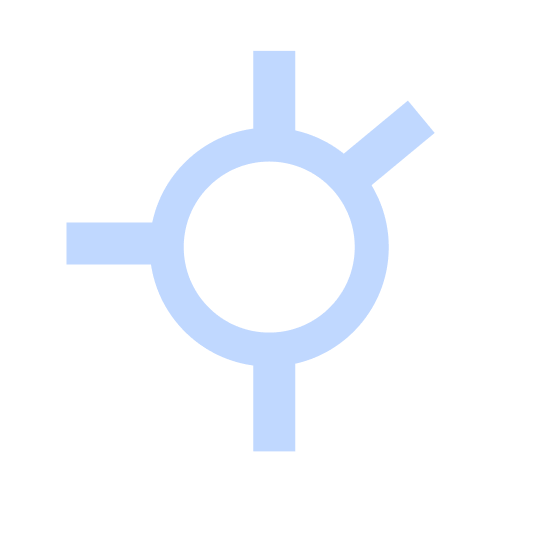</td><td class="confluenceTd">
Non 90° angles
</td></tr><tr><td class="confluenceTd">
3
</td><td class="confluenceTd">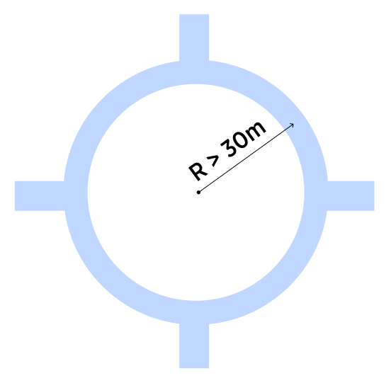</td><td class="confluenceTd">
Radius is bigger then 30m
</td></tr><tr><td class="confluenceTd">
4
</td><td class="confluenceTd"></td><td class="confluenceTd">
Non 90° angles
</td></tr></tbody></table>

**Examples of roundabouts qualified for having straight direction**

<table data-table-width="849" data-layout="align-start" data-local-id="6527a747-53f5-46c9-9c12-ebaeddd860f7" class="confluenceTable"><colgroup><col style="width: 48.0px;"><col style="width: 189.0px;"><col style="width: 493.0px;"></colgroup><tbody><tr><th class="confluenceTh">
<strong>ID</strong>
</th><th class="confluenceTh">
<strong>Geometry</strong>
</th><th class="confluenceTh">
<strong>Reasons Why</strong>
</th></tr><tr><td class="confluenceTd">
1
</td><td class="confluenceTd">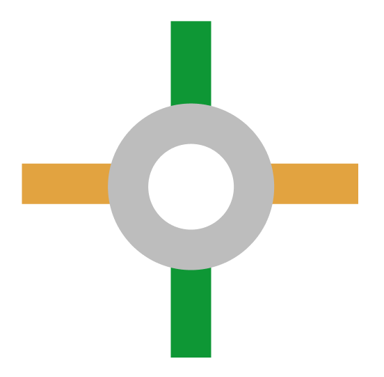</td><td class="confluenceTd">
90° angles, 4 exits
</td></tr><tr><td class="confluenceTd">
2
</td><td class="confluenceTd">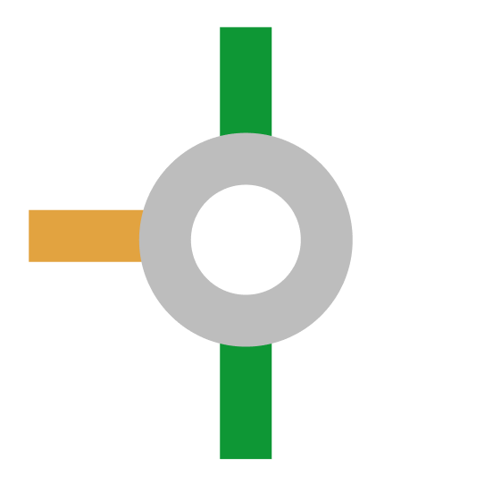</td><td class="confluenceTd">
90° angles, 3 exits
</td></tr></tbody></table>

Single-Lane Roundabouts (excluding Small/Straight)
--------------------------------------------------

Any roundabout that doesn't fall under category of Small, Straight roundabouts and doesn't have multiple lanes is single lane roundabout.  It uses generic instruction composition using _**take the num Exit**_ every time including straight and back directions. This is due to the fact that it is hard to rely on abstract directions when travelling along on medium/large circle.

Multi-Lane Roundabouts
----------------------

Roundabouts that have lane dividers along their circle. Those roundabouts are large in diameter and require correct lane selection at the entry point. Those roundabout instructions focus on lane guidance **Stay in/Take the** _**num**_ **Right/Left lanes to take the num Exit.** This composition could also be used for **Turbo roundabouts.**

Roundabout Instruction composition
==================================

Based on the categorisation of roundabouts defined above, we will define instruction composition for each type separately.

Small/Straight Roundabout instruction composition
-------------------------------------------------

**(distance) + (pointer) + (action) + (purpose) + (direction)**  \- this general structure is used, however, as with all other instruction types some components are optional. The general principle of handling such roundabouts is usage of _**cross the roundabout**_ and _**go around the roundabout**_ actions which are only applicable for small roundabouts.

<table data-table-width="1738" data-layout="align-start" data-local-id="e739044f-c0ea-40af-b3a5-d254e2a2570e" class="confluenceTable"><colgroup><col style="width: 74.0px;"><col style="width: 195.0px;"><col style="width: 271.0px;"><col style="width: 1198.0px;"></colgroup><tbody><tr><th class="confluenceTh">
<strong>ID</strong>
</th><th class="confluenceTh">
<strong>Attribute</strong>
</th><th class="confluenceTh">
<strong>Value</strong>
</th><th class="confluenceTh">
<strong>Notes</strong>
</th></tr><tr><td class="confluenceTd">
#1
</td><td class="confluenceTd">
Distance
</td><td class="confluenceTd">
<strong>in </strong><em><strong>num</strong></em><strong> meters</strong>
</td><td class="confluenceTd">
Distance to the entry point is used according to generic instruction template.
</td></tr><tr><td class="confluenceTd">
#2
</td><td class="confluenceTd">
Pointer
</td><td class="confluenceTd">
<strong>at the roundabout</strong>
</td><td class="confluenceTd">
This pointer is used when direction through the roundabout is <strong>not straight or back</strong> (#3, #4)
</td></tr><tr><td class="confluenceTd">
#3
</td><td class="confluenceTd">
Pointer
</td><td class="confluenceTd">
<strong>cross the Roundabout</strong>
</td><td class="confluenceTd">
This pointer is used when direction through the roundabout <strong>is straight. </strong>Exit number is omitted in this case as, it is straightforward NOTE: This construction is an exception from general pointer syntax, as action is combined with the pointer - this is a necessary concession made to comply with English language structure, but it doesn't affect the logic.
</td></tr><tr><td class="confluenceTd">
#4
</td><td class="confluenceTd">
Pointer
</td><td class="confluenceTd">
<strong>go around the roundabout</strong>
</td><td class="confluenceTd">
This pointer is used only when direction through the roundabout is a U-turn. 

NOTE: This construction is an exception from general pointer syntax, as action is combined with the pointer - this is a necessary concession made to comply with English language structure, but it doesn't affect the logic.
</td></tr><tr><td class="confluenceTd">
#5
</td><td class="confluenceTd">
Action
</td><td class="confluenceTd">
<strong>take the </strong><em><strong>num</strong></em><strong> exit</strong>
</td><td class="confluenceTd">
This action is used every time when direction through the roundabout is not straight or back (#3, #4)
</td></tr><tr><td class="confluenceTd">
#6
</td><td class="confluenceTd">
Action
</td><td class="confluenceTd">
<strong>, </strong><em><strong>num</strong></em><strong> exit</strong>
</td><td class="confluenceTd">
This action is only used to go around the roundabout (#4)
</td></tr><tr><td class="confluenceTd">
#7
</td><td class="confluenceTd">
Purpose
</td><td class="confluenceTd">
<strong>to stay on</strong>
</td><td class="confluenceTd">
This purpose is used only when incoming and outgoing roads are identical (except of "go around the roundabout")
</td></tr><tr><td class="confluenceTd">
#8
</td><td class="confluenceTd">
Direction (roadName/Number)
</td><td class="confluenceTd">
<strong>onto </strong><em><strong>signpostRoadName</strong></em>
</td><td class="confluenceTd">
used only if provided by the signpost. In the presence of towards direction, this field is omitted.
</td></tr><tr><td class="confluenceTd">
#9
</td><td class="confluenceTd">
Direction (Towards)
</td><td class="confluenceTd">
<strong>towards </strong><em><strong>signpostLocation</strong></em>
</td><td class="confluenceTd">
Used when there is a signpost with towards information related to the exit.
</td></tr><tr><td class="confluenceTd">
#10
</td><td class="confluenceTd">
Action
</td><td class="confluenceTd">
<strong>exit the roundabout</strong>
</td><td class="confluenceTd">
Used for exits
</td></tr></tbody></table>

**Example of Instructions for simple / straight Roundabouts**

<table data-table-width="1800" data-layout="align-start" data-local-id="98140777-619d-4295-a267-24436f331fcc" class="confluenceTable"><colgroup><col style="width: 54.0px;"><col style="width: 407.0px;"><col style="width: 155.0px;"><col style="width: 255.0px;"><col style="width: 217.0px;"><col style="width: 161.0px;"><col style="width: 200.0px;"><col style="width: 344.0px;"></colgroup><tbody><tr><th class="confluenceTh">
<strong>ID</strong>
</th><th class="confluenceTh">
<strong>NIP</strong>
</th><th class="confluenceTh">
<strong>distance</strong>
</th><th class="confluenceTh">
<strong>pointer</strong>
</th><th class="confluenceTh">
<strong>action</strong>
</th><th class="confluenceTh">
<strong>purpose</strong>
</th><th class="confluenceTh">
<strong>direction</strong>
</th><th class="confluenceTh">
<strong>reason</strong>
</th></tr><tr><td class="confluenceTd">
#1
</td><td class="confluenceTd"></td><td class="confluenceTd">
in 1 km
</td><td class="confluenceTd">
At the Roundabout
</td><td class="confluenceTd">
take the third exit onto
</td><td class="confluenceTd">
--
</td><td class="confluenceTd">
<em>signpostRoadName</em>
</td><td class="confluenceTd">
Road name is provided by the signpost.
</td></tr><tr><td class="confluenceTd">
#2
</td><td class="confluenceTd"></td><td class="confluenceTd">
in 500 meters
</td><td class="confluenceTd">
Cross the Roundabout
</td><td class="confluenceTd">
-- 
</td><td class="confluenceTd">
--
</td><td class="confluenceTd">
<em>--</em>
</td><td class="confluenceTd">
staying on the same road
</td></tr><tr><td class="confluenceTd">
#5
</td><td class="confluenceTd"></td><td class="confluenceTd">
in 500 meters
</td><td class="confluenceTd">
Go around the Roundabout
</td><td class="confluenceTd">
, second exit
</td><td class="confluenceTd">
--
</td><td class="confluenceTd">
--
</td><td class="confluenceTd">
roadName is omitted.
</td></tr></tbody></table>

Single-lane roundabouts audio instruction attributes (excluding the small and straight roundabouts described above).
--------------------------------------------------------------------------------------------------------------------

**(distance) + (pointer) + (action) + (purpose) + (direction)**  \- this general structure is used, however, as with all other instruction types some components are optional

<table data-table-width="1800" data-layout="full-width" data-local-id="077f5762-2805-4770-bcca-4fa5b06888f1" class="confluenceTable"><colgroup><col style="width: 67.0px;"><col style="width: 187.0px;"><col style="width: 257.0px;"><col style="width: 1289.0px;"></colgroup><tbody><tr><th class="confluenceTh">
<strong>ID</strong>
</th><th class="confluenceTh">
<strong>Attribute</strong>
</th><th class="confluenceTh">
<strong>Value</strong>
</th><th class="confluenceTh">
<strong>Notes</strong>
</th></tr><tr><td class="confluenceTd">
#1
</td><td class="confluenceTd">
Distance
</td><td class="confluenceTd">
<strong>in </strong><em><strong>num</strong></em><strong> meters</strong>
</td><td class="confluenceTd">
Distance to the entry point is used according to the generic instruction template.
</td></tr><tr><td class="confluenceTd">
#2
</td><td class="confluenceTd">
Pointer
</td><td class="confluenceTd">
<strong>at the roundabout</strong>
</td><td class="confluenceTd">
This action is used every time 
</td></tr><tr><td class="confluenceTd">
#3
</td><td class="confluenceTd">
Action
</td><td class="confluenceTd">
<strong>take the </strong><em><strong>num</strong></em><strong> exit</strong>
</td><td class="confluenceTd">
This action is used every time 
</td></tr><tr><td class="confluenceTd">
#4
</td><td class="confluenceTd">
Purpose
</td><td class="confluenceTd">
<strong>to stay on</strong>
</td><td class="confluenceTd">
This purpose is used only when incoming and outgoing roads are identical
</td></tr><tr><td class="confluenceTd">
#5
</td><td class="confluenceTd">
Direction (roadName/Number)
</td><td class="confluenceTd">
<strong>onto </strong><em><strong>roadName</strong></em>
</td><td class="confluenceTd">
Used every time as long as towards is not provided.

Road name/number coming from the signpost has priority over map data as defined globally <a href="https://tomtom.atlassian.net/wiki/spaces/FlaminGO/pages/157686877/Directional+Information+-+Road+names+Road+numbers+Towards" data-linked-resource-id="157686877" data-linked-resource-version="129" data-linked-resource-type="page">NIE_016 - Directional Information (Road names, Road numbers)</a>
</td></tr><tr><td class="confluenceTd">
#6
</td><td class="confluenceTd">
Direction (Towards)
</td><td class="confluenceTd">
<strong>towards </strong><em><strong>signpostLocation</strong></em>
</td><td class="confluenceTd">
Used when there is a signpost with towards information related to the exit.
</td></tr><tr><td class="confluenceTd">
#7
</td><td class="confluenceTd">
Action
</td><td class="confluenceTd">
<strong>exit the roundabout</strong>
</td><td class="confluenceTd">
Used for exits
</td></tr></tbody></table>

NOTE:The main difference in handling of this group of roundabouts is not using "cross the roundabout" and "go around the roundabout" actions. Instead, only exit numbers are used.

**Example of Instructions for single lane Roundabouts**

<table data-table-width="1759" data-layout="align-start" data-local-id="1d9702a6-d0be-477f-9e8f-a12aed325e79" class="confluenceTable"><colgroup><col style="width: 51.0px;"><col style="width: 489.0px;"><col style="width: 100.0px;"><col style="width: 185.0px;"><col style="width: 250.0px;"><col style="width: 131.0px;"><col style="width: 188.0px;"><col style="width: 358.0px;"></colgroup><tbody><tr><th class="confluenceTh">
<strong>ID</strong>
</th><th class="confluenceTh">
<strong>NIP</strong>
</th><th class="confluenceTh">
<strong>distance</strong>
</th><th class="confluenceTh">
<strong>pointer</strong>
</th><th class="confluenceTh">
<strong>action</strong>
</th><th class="confluenceTh">
<strong>purpose</strong>
</th><th class="confluenceTh">
<strong>direction</strong>
</th><th class="confluenceTh">
<strong>reason</strong>
</th></tr><tr><td class="confluenceTd">
#1
</td><td class="confluenceTd"></td><td class="confluenceTd">
in 1 km
</td><td class="confluenceTd">
At the Roundabout
</td><td class="confluenceTd">
take the third exit onto
</td><td class="confluenceTd">
--
</td><td class="confluenceTd">
<em>roadName</em>
</td><td class="confluenceTd">
No signpost towards information available
</td></tr><tr><td class="confluenceTd">
#2
</td><td class="confluenceTd"></td><td class="confluenceTd">
in 1 km
</td><td class="confluenceTd">
At the Roundabout
</td><td class="confluenceTd">
take the second exit 
</td><td class="confluenceTd">

</td><td class="confluenceTd">
towards<em> Dresden</em>
</td><td class="confluenceTd">
Signpost information with Dresden is available in the signpost
</td></tr><tr><td class="confluenceTd">
#6
</td><td class="confluenceTd"></td><td class="confluenceTd">
--
</td><td class="confluenceTd">
--
</td><td class="confluenceTd">
exit the roundabout
</td><td class="confluenceTd">
--
</td><td class="confluenceTd">

</td><td class="confluenceTd">

</td></tr></tbody></table>

### Multi-lane roundabouts audio instruction components

**(distance) + (pointer) + (action) + (purpose) + (direction)**\- this general structure is used, however, as with all other instruction types some components are optional

<table data-table-width="1800" data-layout="full-width" data-local-id="2abfbbf6-fc8a-460a-9117-c3030580c55d" class="confluenceTable"><colgroup><col style="width: 72.0px;"><col style="width: 127.0px;"><col style="width: 297.0px;"><col style="width: 1268.0px;"></colgroup><tbody><tr><th class="confluenceTh">
<strong>ID</strong>
</th><th class="confluenceTh">
<strong>Component</strong>
</th><th class="confluenceTh">
<strong>Value</strong>
</th><th class="confluenceTh">
<strong>Notes</strong>
</th></tr><tr><td class="confluenceTd">
#1
</td><td class="confluenceTd">
Distance
</td><td class="confluenceTd">
<strong>In </strong><em><strong>num</strong></em><strong> meters</strong>
</td><td class="confluenceTd">
Distance is used according to generic instruction template.
</td></tr><tr><td class="confluenceTd">
#2
</td><td class="confluenceTd">
Pointer
</td><td class="confluenceTd">
<strong>at the roundabout</strong>
</td><td class="confluenceTd">
This action is used every time 
</td></tr><tr><td class="confluenceTd">
#3
</td><td class="confluenceTd">
<strong>Action</strong>
</td><td class="confluenceTd">
<strong>stay in </strong><em><strong>num</strong></em><strong> Right/Left lanes</strong>
</td><td class="confluenceTd">
Amount of lanes (num) and their logic varies depending on the geometry and follow generic Lane guidance. This action is used at <strong>Main instruction phase</strong>
</td></tr><tr><td class="confluenceTd">
#4
</td><td class="confluenceTd">
<strong>Purpose</strong>
</td><td class="confluenceTd">
<strong>to take the </strong><em><strong>num</strong></em><strong> exit</strong>
</td><td class="confluenceTd">
This action is used at <strong>Main instruction phase</strong>
</td></tr><tr><td class="confluenceTd">
#5
</td><td class="confluenceTd">
<strong>Action</strong>
</td><td class="confluenceTd">
<strong>take the </strong><em><strong>num</strong></em><strong> exit</strong>
</td><td class="confluenceTd">
This action is used at <strong>Early instruction phase</strong>
</td></tr><tr><td class="confluenceTd">
#6
</td><td class="confluenceTd">
Direction
</td><td class="confluenceTd">
<strong>to </strong><em><strong>roadName</strong></em>
</td><td class="confluenceTd">
Used every time as long as towards is not provided.

Road name/number coming from the signpost has priority over map data as defined globally <a href="https://tomtom.atlassian.net/wiki/spaces/FlaminGO/pages/157686877/Directional+Information+-+Road+names+Road+numbers+Towards" data-linked-resource-id="157686877" data-linked-resource-version="129" data-linked-resource-type="page">NIE_016 - Directional Information (Road names, Road numbers)</a>
</td></tr><tr><td class="confluenceTd">
#7
</td><td class="confluenceTd">
Direction
</td><td class="confluenceTd">
<strong>towards </strong><em><strong>signpostLocation</strong></em>
</td><td class="confluenceTd">
Used when there is a signpost with towards information related to the exit
</td></tr><tr><td class="confluenceTd">
#8
</td><td class="confluenceTd">
Action
</td><td class="confluenceTd">
<strong>exit the roundabout</strong>
</td><td class="confluenceTd">
Used for exits
</td></tr></tbody></table>

**Example of Instructions for multi-lane roundabouts:**

<table data-table-width="1664" data-layout="align-start" data-local-id="7f6725f1-dfae-4965-98b2-9c4497549fac" class="confluenceTable"><colgroup><col style="width: 56.0px;"><col style="width: 416.0px;"><col style="width: 97.0px;"><col style="width: 166.0px;"><col style="width: 198.0px;"><col style="width: 166.0px;"><col style="width: 204.0px;"><col style="width: 156.0px;"><col style="width: 198.0px;"></colgroup><tbody><tr><th class="confluenceTh">
<strong>id</strong>
</th><th class="confluenceTh">
<strong>NIP</strong>
</th><th class="confluenceTh">
<strong>Phase</strong>
</th><th class="confluenceTh">
<strong>distance</strong>
</th><th class="confluenceTh">
<strong>pointer</strong>
</th><th class="confluenceTh">
<strong>action</strong>
</th><th class="confluenceTh">
<strong>purpose</strong>
</th><th class="confluenceTh">
<strong>direction</strong>
</th><th class="confluenceTh">
<strong>Reason</strong>
</th></tr><tr><td class="confluenceTd">
#1
</td><td class="confluenceTd">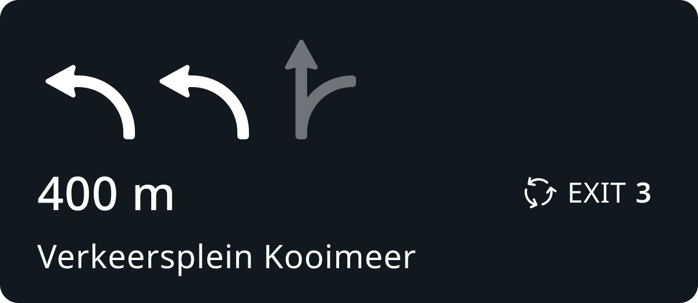</td><td class="confluenceTd">
Main
</td><td class="confluenceTd">
in 400meters
</td><td class="confluenceTd">
At the Roundabout
</td><td class="confluenceTd">
stay in two left lanes
</td><td class="confluenceTd">
to take the third exit
</td><td class="confluenceTd">
to <em>roadName</em>
</td><td class="confluenceTd">
No signpost towards information available
</td></tr><tr><td class="confluenceTd">
#2
</td><td class="confluenceTd"></td><td class="confluenceTd">
Main
</td><td class="confluenceTd">
in 400meters
</td><td class="confluenceTd">
At the Roundabout
</td><td class="confluenceTd">
stay in two left lanes
</td><td class="confluenceTd">
to take the third exit
</td><td class="confluenceTd">
towards <em>signpostLocation</em>
</td><td class="confluenceTd">
Road name is replaced with the towards, because it is provided in the signpost
</td></tr><tr><td class="confluenceTd">
#3
</td><td class="confluenceTd">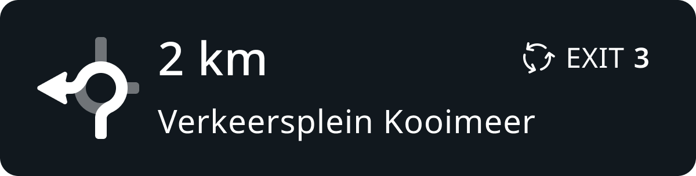</td><td class="confluenceTd">
Early
</td><td class="confluenceTd">
in 2 km
</td><td class="confluenceTd">
At the Roundabout
</td><td class="confluenceTd">
take the third exit
</td><td class="confluenceTd">
--
</td><td class="confluenceTd">
to <em>roadName</em>
</td><td class="confluenceTd">
No signpost towards information available
</td></tr><tr><td class="confluenceTd">
#4
</td><td class="confluenceTd"></td><td class="confluenceTd">
--
</td><td class="confluenceTd">
--
</td><td class="confluenceTd">
--
</td><td class="confluenceTd">
exit the roundabout
</td><td class="confluenceTd">
--
</td><td class="confluenceTd">
to <em>roadName</em>
</td><td class="confluenceTd">

</td></tr></tbody></table>

Roundabout exits counting (identifying _num_ parameter)
=======================================================

Roundabout exits can have various angles relative to the direction of entry. NIE supports max 8 exits. All possible directions must be mapped to 8(max.) directions.  Each exit is identified by a number which is going counterclockwise. NOTE: For Right handed driving countries (UK, Japan) the direction is inverted.

### Dealing with Tangential exits

Tangential exits, technically, are not belongs to a roundabout as they bypass it via dedicated straight paths. Those exits should not be counted and should not even be considered as roundabout instructions. I

**Tangential exits**

<table data-table-width="1228" data-layout="align-start" data-local-id="485d87ef-3258-4ed6-9b92-bfd2cd80d3f0" class="confluenceTable"><colgroup><col style="width: 166.0px;"><col style="width: 427.0px;"><col style="width: 634.0px;"></colgroup><tbody><tr><th class="confluenceTh">
<strong>Type</strong>
</th><th class="confluenceTh">
<strong>Diagram</strong>
</th><th class="confluenceTh">
<strong>Notes</strong>
</th></tr><tr><td class="confluenceTd">
Tangential
</td><td class="confluenceTd">

</td><td class="confluenceTd">
Tangential lines that are passing by the roundabout <em><strong>without even touching the the circle perimeter.</strong></em> The instruction should not be <em>Roundabout instruction,</em> but rather <em>Turn, Bear, Keep</em> - whatever is applicable for the given geometry.

NOTE: If tangential line touches the perimeter (has a common segment), the exit is considered to be belongs to roundabout. If the route passes through a roundabout (has at least one roundabout arc) then a roundabout instruction is generated. If the route just includes a roundabout junction and doesn't include a roundabout arc, roundabout instruction is not generated.
</td></tr></tbody></table>

\----- END OF DOCUMENT -----\----- END OF DOCUMENT -----